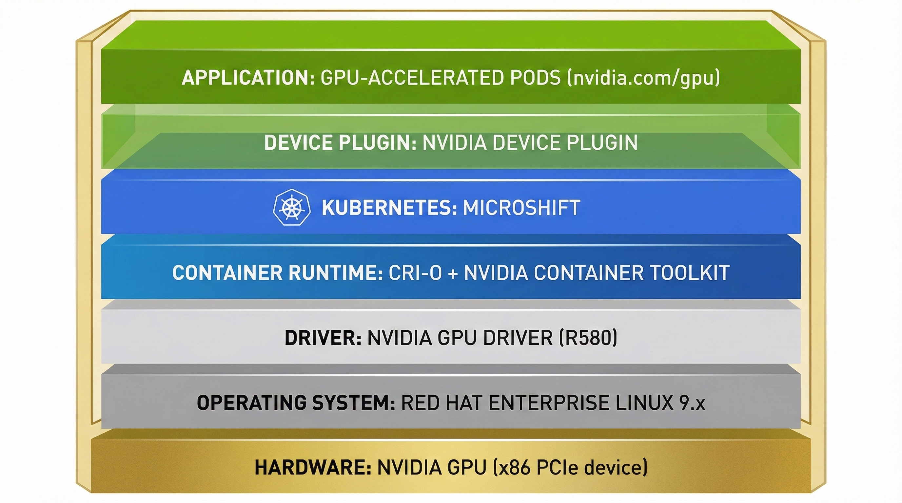
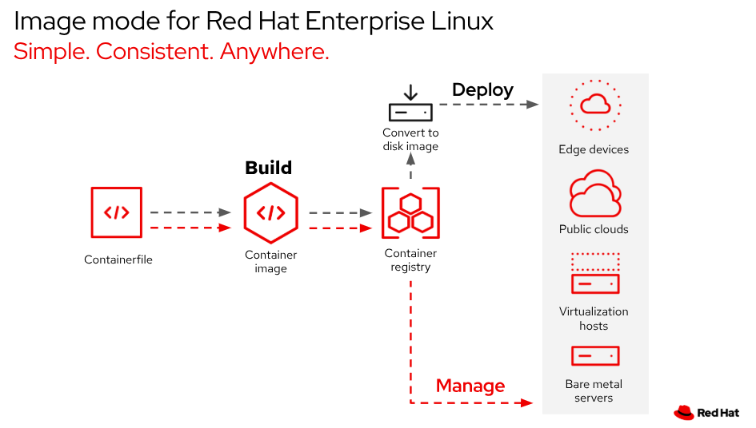

.. Date: February 09, 2013
.. Author: stesmith

.. headings are # * - =

.. _mirror-gpu-ocp-disconnected:

################################################################
Accelerating workloads with NVIDIA GPUs with Red Hat Device Edge
################################################################

.. contents::
   :depth: 3
   :local:
   :backlinks: entry

**************
Introduction
**************

`Red Hat Device Edge <https://docs.redhat.com/en/documentation/red_hat_device_edge/4/html/overview/device-edge-overview>`_ combines lightweight Kubernetes using `MicroShift <https://docs.redhat.com/en/documentation/red_hat_build_of_microshift/latest>`_ with Red Hat Enterprise Linux at the edge. 

MicroShift is a Kubernetes implementation derived from OpenShift, focusing on a minimal footprint for single-node deployments in resource-constrained locations. MicroShift became generally available (GA) with `release 4.14 <https://docs.redhat.com/en/documentation/red_hat_build_of_microshift/4.14/html/release_notes/microshift-4-14-release-notes#microshift-4-14-about-this-release>`_, and at the time of this writing, the current release is `4.20 <https://docs.redhat.com/en/documentation/red_hat_build_of_microshift/4.20/html/red_hat_build_of_microshift_release_notes/red-hat-build-of-microshift-4.20-release-notes>`_. This platform enables you to deploy bare metal, virtual, containerized, or Kubernetes workloads to edge environments, with support for streamlined over-the-air updates for managed RHEL devices in hard-to-service locations.

This guide provides procedures to enable workloads to use NVIDIA GPUs on an x86 system running Red Hat Device Edge. The procedures documented here are validated for production use and are supported through `NVIDIA Enterprise Support agreement <https://www.nvidia.com/en-us/data-center/products/ai-enterprise-suite/support/>`_ and `Red Hat Production Support Terms of Service <https://access.redhat.com/support/offerings/production/>`_.

.. note::
   This documentation supports NVIDIA GPU enablement on Red Hat Device Edge deployments using:
   
   * `RPM-based installations <https://docs.redhat.com/en/documentation/red_hat_build_of_microshift/4.20/html/installing_with_an_rpm_package/index>`_: Standard RHEL installations using RPM packages
   * `Image Mode <https://docs.redhat.com/en/documentation/red_hat_build_of_microshift/4.20/html/installing_with_image_mode_for_rhel/index>`_: Container-native bootable image deployments using RHEL Image Mode (based on the `bootc <https://docs.fedoraproject.org/en-US/bootc/getting-started/>`_ upstream project)
   * `RHEL for Edge <https://docs.redhat.com/en/documentation/red_hat_build_of_microshift/4.20/html/embedding_in_a_rhel_for_edge_image/index>`_: Image Builder-based immutable OS deployments (based on rpm-ostree)
   
   The procedures are applicable across these deployment methods, with specific considerations noted where differences exist.

**Document Overview**

This guide is organized into the following sections:

* :ref:`prerequisites` - Common and method-specific prerequisites, including repository access and version locking
* :ref:`installation-procedures` - Installation procedures for three deployment methods:
  
  * :ref:`rpm-based-installation` - Sequential installation on running systems
  * :ref:`rhel-for-edge-installation` - Image composition with blueprints and Ignition
  * :ref:`image-mode-installation` - Container image build with Containerfiles
* :ref:`supportability-compatibility` - Support policies, compatibility matrices, and additional resources

Use the table of contents above to navigate directly to specific sections.

**************************
Architecture Overview
**************************

The NVIDIA GPU integration with Red Hat Device Edge consists of multiple layers working together to expose GPU resources to containerized workloads running in MicroShift.

   Architecture Stack: Hardware → OS → Drivers → Container Runtime → Kubernetes → Device Plugin → Applications

The component stack flows from hardware to application:

* **Hardware Layer**: NVIDIA GPU (x86 PCIe device)
* **Operating System Layer**: Red Hat Enterprise Linux 9.x
* **Driver Layer**: NVIDIA GPU Driver (R580 Production Branch) - kernel modules, libraries, and management tools
* **Container Runtime Layer**: CRI-O + NVIDIA Container Toolkit - configures containers for GPU access
* **Kubernetes Layer**: MicroShift - orchestrates container workloads
* **Device Plugin Layer**: NVIDIA Device Plugin - exposes GPU resources to Kubernetes
* **Application Layer**: GPU-accelerated Kubernetes pods requesting ``nvidia.com/gpu`` resources

**********************************
Deployment Method Comparison
**********************************

This guide supports three deployment methodologies. Use the following comparison to select the appropriate method for your environment.

.. list-table:: Deployment Method Comparison
   :header-rows: 1
   :widths: 20 20 15 15 15 15

   * - Deployment Method
     - Use Case
     - Immutability
     - Update Mechanism
     - Build Requirements
     - Best For
   * - **RPM-based**
     - Traditional mutable systems
     - Mutable (can be modified at runtime)
     - ``dnf update`` on running system
     - None (install directly on running system)
     - Development, testing, traditional IT environments, systems requiring frequent package updates
   * - **RHEL for Edge (rpm-ostree)**
     - Immutable edge deployments
     - Immutable (atomic updates only)
     - Atomic image updates via OSTree
     - Image Builder VM, blueprint composition, repository sources
     - Production edge deployments, air-gapped environments, systems requiring atomic rollback, fleet management
   * - **Image Mode (bootc)**
     - Container-native immutable systems
     - Immutable (container image updates)
     - Container image updates via ``bootc``
     - Container build system, Containerfile, container registry
     - Modern edge deployments, CI/CD pipelines, container-native workflows, cloud-native edge computing. systems requiring atomic rollback, fleet management

******************
Bill of Materials
******************

This section provides the validated software version combinations for this guide.

**Supported RHEL and MicroShift Combinations**

.. list-table:: Supported RHEL and MicroShift Combinations
   :header-rows: 1
   :widths: 25 30 45

   * - RHEL Version
     - MicroShift Versions
     - Notes
   * - RHEL 9.6
     - 4.20, 4.19
     - Current EUS release, recommended for new deployments
   * - RHEL 9.4
     - 4.18, 4.17, 4.16
     - EUS release, supported for existing deployments
   * - RHEL 9.2
     - 4.15 (EOL), 4.14 (EUS 2 only)
     - EUS release. MicroShift 4.15 is End of Life. MicroShift 4.14 is only supported under Extended Update Support Term 2 (EUS 2)

**NVIDIA Component Versions**

.. list-table:: NVIDIA Component Versions
   :header-rows: 1
   :widths: 30 25 45

   * - Component
     - Recommended Version
     - Notes
   * - NVIDIA GPU Driver
     - R580 (Production Branch)
     - Current stable Production Branch. R575, R565, R560, R550, R525 are EOL
   * - NVIDIA Container Toolkit
     - v1.17.9+
     - Validated for production use. Check compatibility with Device Plugin version
   * - NVIDIA Device Plugin
     - 0.18.0+ (Helm, recommended) or Latest (static manifests)
     - Helm charts are NVIDIA's recommended method for production deployments. Static manifests are available as an alternative

.. important::
   **Setting the RHEL Release is Critical**: Always set your RHEL minor release to match your MicroShift version using ``subscription-manager release --set=<version>`` for RPM-based installations, or ensure your build host matches the target RHEL version for immutable deployments. Failure to set the release can result in dependency errors and unsupported configurations.

****************
Prerequisites
****************

.. _prerequisites:

**In this section**: This section covers prerequisites common to all deployment methods, including repository access, GPU verification, and version locking requirements. Method-specific prerequisites are detailed at the end.

**Common Prerequisites**

* Install MicroShift on your Red Hat Enterprise Linux 9.x machine or build a new System Image (rpm-ostree or bootc) using one of the supported methods:
  
  * `Installing MicroShift with an RPM package <https://docs.redhat.com/en/documentation/red_hat_build_of_microshift/4.20/html/installing_with_an_rpm_package/index>`_
  * `Embedding MicroShift in a RHEL for Edge image <https://docs.redhat.com/en/documentation/red_hat_build_of_microshift/4.20/html/embedding_in_a_rhel_for_edge_image/index>`_
  * `Installing MicroShift with image mode for RHEL <https://docs.redhat.com/en/documentation/red_hat_build_of_microshift/4.20/html/installing_with_image_mode_for_rhel/index>`_

.. important::
   Red Hat Device Edge requires specific RHEL and MicroShift version combinations that align with `RHEL Extended Update Support (EUS) <https://access.redhat.com/articles/rhel-eus>`_ releases. Not all RHEL 9.x versions are compatible with all MicroShift versions. Always verify the latest support policy and compatibility matrix before deployment to ensure your RHEL and MicroShift versions are supported together and within their lifecycle phases. For the current compatible and supported versions of MicroShift and RHEL for Edge, including related lifecycle dates, refer to:
   
   * `Red Hat Device Edge Support Policy <https://access.redhat.com/support/policy/updates/rhde>`_
   * `Red Hat Product Life Cycles <https://access.redhat.com/product-life-cycles?product=Red%20Hat%20Device%20Edge,Red%20Hat%20build%20of%20Microshift>`_
   * `MicroShift system requirements and compatibility table <https://docs.redhat.com/en/documentation/red_hat_build_of_microshift/4.20/html/getting_ready_to_install_microshift/microshift-install-get-ready#microshift-install-system-requirements_microshift-install-get-ready>`_
   
   As of this writing, supported combinations include:
   
   * RHEL 9.6 with MicroShift 4.20 or 4.19
   * RHEL 9.4 with MicroShift 4.18, 4.17, or 4.16
   * RHEL 9.2 with MicroShift 4.15 (EOL) or 4.14 (EUS 2 only)
   
   .. important::
      **MicroShift 4.15 is End of Life (EOL)** and should not be used for new deployments. **MicroShift 4.14 is only supported under Extended Update Support Term 2 (EUS 2)**. For new deployments, use MicroShift 4.20 or 4.19 with RHEL 9.6.
   
   **Setting the RHEL Release Version**: Setting the Red Hat Enterprise Linux (RHEL) release version is critical to prevent unintended upgrades into an unsupported configuration. Compatibility is essential, as RPM dependency errors result if a MicroShift update is incompatible with the version of RHEL. This requirement applies to all deployment methods:
   
   * **For RPM-based installations**: The process involves running the command ``$ sudo subscription-manager release --set=<version>`` on the running system to tie the system to a specific RHEL minor release, thereby helping to avoid unintended updates into an unsupported configuration.
   
   * **For RHEL for Edge (rpm-ostree) and Image Mode (bootc) installations**: When building the immutable operating system image, the build host—such as the Image Builder VM or container build system—is required to be on the same RHEL minor release as the target system (e.g., RHEL 9.6 host building a RHEL 9.6 image) to ensure the necessary RHEL version compatibility with MicroShift.
   
   See the deployment-method-specific prerequisites section below for detailed instructions.

**Deployment-Method-Specific Prerequisites**

All deployment methods require the same base repositories and GPU verification, but differ in where and how these prerequisites are met:

**Common Prerequisites (All Methods)**

* **Repository Access**: All methods require access to the following Red Hat repositories:
  
  * ``rhel-9-for-x86_64-baseos-rpms``
  * ``rhel-9-for-x86_64-appstream-rpms``
  * MicroShift repositories (as documented in the MicroShift installation guide)
  
  The difference is where these repositories are accessed:
  
  * **RPM-based**: On the target system where packages are installed
  * **RHEL for Edge and Image Mode**: On the build system (Image Builder VM or container build system) where images are composed

* **GPU Verification**: Verify an NVIDIA GPU is installed on the target device (for RPM-based) or after deploying the image (for RHEL for Edge and Image Mode):

  .. code-block:: console

     $ lspci -nnv | grep -i nvidia

  **Example Output**

  .. code-block:: output

     17:00.0 3D controller [0302]: NVIDIA Corporation GA100GL [A30 PCIe] [10de:20b7] (rev a1)
             Subsystem: NVIDIA Corporation Device [10de:1532]

* **Setting the RHEL Release**: Set the system to the specific RHEL minor release that matches your MicroShift version:
  
  * For MicroShift 4.20 or 4.19: Use ``subscription-manager release --set=9.6``
  * For MicroShift 4.18, 4.17, or 4.16: Use ``subscription-manager release --set=9.4``
  * For MicroShift 4.14 (EUS 2 only): Use ``subscription-manager release --set=9.2``
  
  .. warning::
     **MicroShift 4.15 is End of Life (EOL)** and is no longer supported. Do not use MicroShift 4.15 for new deployments. MicroShift 4.14 is only supported under Extended Update Support Term 2 (EUS 2).

  .. note::
     * Verify available releases with ``subscription-manager release --list``
     * Check current release setting with ``subscription-manager release --show``
     * For detailed information about setting the release, see `How to tie/untie a system to a specific update of Red Hat Enterprise Linux <https://access.redhat.com/solutions/238533>`_

**Method-Specific Requirements**

**For RPM-Based Installations**

* Set the **target system** to a specific RHEL minor release before installing packages to prevent unintended upgrades:

  .. code-block:: console

     $ subscription-manager release --set=9.6

  .. note::
     It is recommended to set the release before installing packages to avoid dependency issues.

**For RHEL for Edge (rpm-ostree) and Image Mode (bootc) Installations**

Both immutable deployment methods share the same build system requirements. The same Image Builder VM or container build system can be used to build both RHEL for Edge and Image Mode images, allowing you to maintain multiple deployment branches from a single build environment.

* Set the **build system** (Image Builder VM or container build system) to the target RHEL minor release before building images:

  .. code-block:: console

     $ subscription-manager release --set=9.6

  .. important::
     The build system should ideally be at the same RHEL minor release version as the target system to ensure compatibility and consistent package versions. This applies to both RHEL for Edge (Image Builder VM) and Image Mode (container build system) deployments.
  
  .. note::
     * The build system requires repository access to pull or install MicroShift, NVIDIA driver packages, and other dependencies during image composition. The target edge device does not need direct repository access, as all required packages are included in the composed image.
     * **EUS Repository Configuration**: If you are using an Extended Update Support (EUS) release of MicroShift or RHEL, you must configure Image Builder to use EUS repositories. This involves modifying the repository configuration files in `/etc/osbuild-composer/repositories/` to point to EUS repository URLs. For detailed procedures on enabling EUS repositories for Image Builder, see `Enabling extended support repositories for image building <https://docs.redhat.com/en/documentation/red_hat_build_of_microshift/4.20/html/embedding_in_a_rhel_for_edge_image/embedding-microshift-in-a-rhel-for-edge-image_embedding-in-a-rhel-for-edge-image#enabling-extended-support-repositories-for-image-building_embedding-microshift-in-a-rhel-for-edge-image>`_ in the MicroShift documentation.
     * **Unified Build Environment**: You can use the same Image Builder VM to build both RHEL for Edge blueprints and Image Mode container images, allowing you to maintain consistent versions across both deployment methods from a single build system.

.. _installation-procedures:

********************************
Installation Procedures
********************************

**In this section**: Each deployment method includes complete installation steps for the NVIDIA GPU driver, Container Toolkit, and Device Plugin. For RPM-based installations, components are installed sequentially on a running system. For RHEL for Edge and Image Mode, all components are embedded in the image during build.

This guide provides installation procedures for enabling NVIDIA GPU support on Red Hat Device Edge. The procedures differ depending on your deployment method:

**Quick Navigation:**

* :ref:`rpm-based-installation` - For standard RPM-based RHEL installations (sequential installation of driver, container toolkit, and device plugin)
* :ref:`rhel-for-edge-installation` - For RHEL for Edge immutable deployments (embedding all components in the image)
* :ref:`image-mode-installation` - For RHEL Image Mode deployments (embedding all components in the container image)

Choose the appropriate section based on your deployment method.

.. note::
   **In this section**: Each deployment method includes complete installation steps for the NVIDIA GPU driver, Container Toolkit, and Device Plugin. For RPM-based installations, components are installed sequentially on a running system. For RHEL for Edge and Image Mode, all components are embedded in the image during build.

.. _rpm-based-installation:

********************************
RPM-Based Installation
********************************

**In this section**: This section provides sequential installation steps for the NVIDIA GPU driver (Step 1), Container Toolkit (Step 2), and Device Plugin (Step 3) on a running RPM-based RHEL system. Each step includes verification procedures.

For standard RHEL installations using RPM packages, install the NVIDIA GPU driver, Container Toolkit, and Device Plugin sequentially on a running system. This procedure applies to new systems with NVIDIA GPUs.

**About NVIDIA Drivers**

NVIDIA provides precompiled drivers in RPM repositories that implement the modularity mechanism. This approach is recommended for production deployments as it avoids the need for compiler toolchains and `Extra Packages for Enterprise Linux (EPEL) <https://access.redhat.com/solutions/3358>`_ dependencies.

.. note::
   **EPEL and DKMS are not supported for production use**. While EPEL can provide compiler toolchains and DKMS (Dynamic Kernel Module Support) needed to build NVIDIA drivers from source, both are community-supported and not part of Red Hat Enterprise Linux. DKMS automatically rebuilds kernel modules when new kernels are installed, but according to `Is DKMS provided in Red Hat Enterprise Linux? <https://access.redhat.com/solutions/1132653>`_, DKMS is not supplied or supported by Red Hat. The precompiled driver approach documented here avoids these risks by using packages from NVIDIA's official RPM repositories. For more information about EPEL support policies, see `How to use Extra Packages for Enterprise Linux (EPEL) <https://access.redhat.com/solutions/3358>`_.

For production deployments, use the standard NVIDIA-signed pre-compiled drivers from the NVIDIA CUDA repository. These drivers are fully supported and validated for production use.

Starting with RHEL 9.5, NVIDIA and Red Hat have partnered to provide `NVIDIA Open GPU Datacenter Drivers for RHEL9 signed by Red Hat <https://developer.nvidia.com/blog/nvidia-open-gpu-datacenter-drivers-for-rhel9-signed-by-red-hat>`_ as a tech preview option. These signed open GPU drivers can be installed and used without any extra key enrollment configuration, making them useful for testing on systems with Secure Boot enabled. As of this writing, the open GPU drivers are available in tech preview and require the NVIDIA CUDA preview repository. **Open GPU drivers should only be used for testing purposes, not for production deployments.**

For more information about modularity streams and driver deployment, see `Streamlining NVIDIA Driver Deployment on RHEL 8 with Modularity Streams <https://developer.nvidia.com/blog/streamlining-nvidia-driver-deployment-on-rhel-8-with-modularity-streams/>`_.

.. important::
   Use a supported Production Branch driver version. As of this writing, R580 is the current stable Production Branch. Previous branches such as R575, R565, R560, R550, and R525 are End-of-Life (EOL) and should not be used in production. For the latest supported driver versions, refer to `NVIDIA Datacenter Drivers documentation <https://docs.nvidia.com/datacenter/tesla/drivers/supported-drivers-and-cuda-toolkit-versions.html>`_.

**Step 1: Installing the NVIDIA GPU Driver**

This procedure applies to standard RHEL installations using RPM packages on a new system with an NVIDIA GPU.

**Choosing a Driver Type**

For production deployments, use the standard NVIDIA-signed pre-compiled driver. The open GPU driver is available as a tech preview option for testing only:

* **Standard NVIDIA-Signed Driver (Recommended for Production)**: Pre-compiled driver signed by NVIDIA, requires NVIDIA signing key enrollment for Secure Boot. Available as modularity streams from the standard CUDA repository:
  
  * ``nvidia-driver:latest`` - Latest NVIDIA-signed driver
  * ``nvidia-driver:<version>`` - Specific version (e.g., ``nvidia-driver:580``)
  
  .. note::
     The standard CUDA repository also provides some ``-open`` streams (e.g., ``nvidia-driver:580-open``, ``nvidia-driver:570-open``), but these are different from the ``-open-gpu`` streams available in the preview repository. The ``-open-gpu`` streams are the Red Hat signed open GPU drivers.

* **Open GPU Driver (Tech Preview - Testing Only)**: Signed by Red Hat, works with Secure Boot without key enrollment. Available as modularity streams from the NVIDIA CUDA preview repository:
  
  * ``nvidia-driver:latest-open-gpu`` - Latest open GPU driver (available in preview repository)
  * ``nvidia-driver:<version>-open-gpu`` - Specific version (e.g., ``nvidia-driver:570-open-gpu``, ``nvidia-driver:535-open-gpu``)
  
  .. warning::
     The open GPU drivers are currently in tech preview and should **only be used for testing purposes, not for production deployments**. They require the NVIDIA CUDA preview repository. Not all driver versions have open GPU variants available. Use ``dnf module list nvidia-driver`` after adding the preview repository to see available ``-open-gpu`` streams. See `NVIDIA Open GPU Datacenter Drivers for RHEL9 signed by Red Hat <https://developer.nvidia.com/blog/nvidia-open-gpu-datacenter-drivers-for-rhel9-signed-by-red-hat>`_ for details.

#. Ensure your system is subscribed to Red Hat repositories and has access to:
  
  * ``rhel-9-for-x86_64-baseos-rpms``
  * ``rhel-9-for-x86_64-appstream-rpms``
  * ``codeready-builder-for-rhel-9-x86_64-rpms`` (required for open GPU driver)

  .. important::
     Before installing packages, ensure your system is set to the correct RHEL minor release as described in the Prerequisites section. This prevents unintended upgrades that could break compatibility with your MicroShift version.

#. Add the NVIDIA CUDA repository:

   .. code-block:: console

      $ sudo dnf config-manager --add-repo=https://developer.download.nvidia.com/compute/cuda/repos/rhel9/x86_64/cuda-rhel9.repo

   .. note::
      The standard CUDA repository provides NVIDIA-signed pre-compiled drivers and some ``-open`` streams. For open GPU drivers (``-open-gpu`` streams), you must also add the preview repository:
      
      .. code-block:: console
      
         $ sudo dnf config-manager --add-repo=https://developer.download.nvidia.com/compute/cuda/preview/repos/rhel9/x86_64/
      
      The preview repository is currently required for open GPU drivers. Check the NVIDIA documentation for the latest information on repository availability.

#. View available driver modules:

   .. code-block:: console

      $ dnf module list nvidia-driver

#. Install the driver. For production deployments, use the standard NVIDIA-signed driver:

   .. code-block:: console

      $ sudo dnf module install nvidia-driver:580

   Or for the latest version:

   .. code-block:: console

      $ sudo dnf module install nvidia-driver:latest

   .. note::
      You can list available driver versions using:
      
      .. code-block:: console
      
         $ dnf module list nvidia-driver

   For testing purposes only, you can use the open GPU driver (tech preview):

   .. code-block:: console

      $ sudo dnf module install nvidia-driver:latest-open-gpu

   Or for a specific version (check available versions with ``dnf module list nvidia-driver``):

   .. code-block:: console

      $ sudo dnf module install nvidia-driver:570-open-gpu

   .. warning::
      The open GPU drivers are in tech preview and should only be used for testing, not production. Not all driver versions have open GPU variants. Use ``dnf module list nvidia-driver`` to see which ``-open-gpu`` streams are available in the preview repository.

   .. code-block:: console

      $ sudo dnf module install nvidia-driver:580

   .. note::
      You can list available driver versions using:
      
      .. code-block:: console
      
         $ dnf module list nvidia-driver
      
      Or install the latest available version with:
      
      .. code-block:: console
      
         $ sudo dnf module install nvidia-driver:latest

#. (Optional) If you require fabric manager and NSCQ support, install the additional packages:

   .. code-block:: console

      $ sudo dnf install nvidia-fabric-manager libnvidia-nscq-580

   .. note::
      Replace ``580`` with your installed driver version if different.

#. After installing the driver, disable the ``nouveau`` driver because it conflicts with the NVIDIA driver:

   .. code-block:: console

      $ echo 'blacklist nouveau' | sudo tee /etc/modprobe.d/nouveau-blacklist.conf

#. Update initramfs:

   .. code-block:: console

      $ sudo dracut --force

#. Enable the ``nvidia-persistenced`` service to reduce driver initialization time:

   .. code-block:: console

      $ sudo systemctl enable nvidia-persistenced.service

   If you installed fabric manager, also enable it:

   .. code-block:: console

      $ sudo systemctl enable nvidia-fabricmanager.service

#. Reboot the machine:

   .. code-block:: console

      $ sudo systemctl reboot

#. After the machine boots, verify that the NVIDIA drivers are installed properly:

   .. code-block:: console

      $ nvidia-smi

   **Example Output**

   .. code-block:: output

      Thu Jun 22 14:29:53 2023
      +-----------------------------------------------------------------------------+
      | NVIDIA-SMI 580.xx.xx   Driver Version: 580.xx.xx   CUDA Version: 12.x     |
      |-------------------------------+----------------------+----------------------+
      | GPU  Name        Persistence-M| Bus-Id        Disp.A | Volatile Uncorr. ECC |
      | Fan  Temp  Perf  Pwr:Usage/Cap|         Memory-Usage | GPU-Util  Compute M. |
      |                               |                      |               MIG M. |
      |===============================+======================+======================|
      |   0  NVIDIA A30          Off  | 00000000:17:00.0 Off |                    0 |
      | N/A   29C    P0    35W / 165W |      0MiB / 24576MiB |     25%      Default |
      |                               |                      |             Disabled |
      +-------------------------------+----------------------+----------------------+

      +-----------------------------------------------------------------------------+
      | Processes:                                                                  |
      |  GPU   GI   CI        PID   Type   Process name                  GPU Memory |
      |        ID   ID                                                   Usage      |
      |=============================================================================|
      |  No running processes found                                                 |
      +-----------------------------------------------------------------------------+

**Step 2: Installing the NVIDIA Container Toolkit**

The `NVIDIA Container Toolkit <https://docs.nvidia.com/datacenter/cloud-native/container-toolkit/overview.html>`_ enables users to build and run GPU accelerated containers. The toolkit includes a container runtime library and utilities to automatically configure containers to leverage NVIDIA GPUs. You must install it to enable the container runtime to transparently configure the NVIDIA GPUs for the pods deployed in MicroShift.

The NVIDIA container toolkit supports the distributions listed in the `NVIDIA Container Toolkit repository <https://docs.nvidia.com/datacenter/cloud-native/container-toolkit/install-guide.html#installation-guide/>`_.

.. important::
   Ensure version compatibility between the NVIDIA Container Toolkit and the NVIDIA Device Plugin. As of this writing, version 1.17.9+ of the container toolkit is recommended. Always verify compatibility with your target Device Plugin version.

#. Add the NVIDIA Container Toolkit repository:

   .. code-block:: console

      $ curl -s -L https://nvidia.github.io/libnvidia-container/stable/rpm/nvidia-container-toolkit.repo | \
          sudo tee /etc/yum.repos.d/nvidia-container-toolkit.repo

   .. note::
      This uses the stable repository, which is recommended for production deployments.

#. Install the NVIDIA Container Toolkit:

   .. code-block:: console

      $ sudo dnf install nvidia-container-toolkit -y

   .. note::
      To install a specific version for compatibility, you can specify the version:
      
      .. code-block:: console
      
         $ sudo dnf install nvidia-container-toolkit-1.17.9-1 -y
      
      To prevent automatic updates, you can use package version locking:
      
      .. code-block:: console
      
         $ sudo dnf install -y python3-dnf-plugin-versionlock
         $ sudo dnf versionlock add nvidia-container-toolkit-1.17.9-1.*

#. Set the SELinux boolean to allow containers to use devices:

   .. code-block:: console

      $ sudo setsebool -P container_use_devices on

   .. note::
      With Container Toolkit v1.17.9+ and RHEL 9.x, the ``container_use_devices`` SELinux boolean is sufficient for GPU workloads. Custom SELinux modules are no longer required for standard deployments. If you encounter SELinux permission errors in specific environments, please raise a support case to NVIDIA.

#. Configure CRI-O to use the NVIDIA runtime. This creates a drop-in configuration file that ensures the NVIDIA runtime is used:

   .. code-block:: console

      $ sudo nvidia-ctk runtime configure --runtime=crio --set-as-default \
          --drop-in-config=/etc/crio/crio.conf.d/99-nvidia.conf

   .. important::
      In MicroShift 4.20+, the MicroShift configuration file is already named ``10-microshift.conf``, ensuring it loads before ``99-nvidia.conf``. For MicroShift 4.14 and 4.15, the configuration files may not use numerical prefixes. If you encounter issues, rename the MicroShift configuration files to ensure proper load order:
      
      .. code-block:: console
      
         $ if [ -f /etc/crio/crio.conf.d/microshift.conf ]; then
             sudo mv /etc/crio/crio.conf.d/microshift.conf /etc/crio/crio.conf.d/10-microshift.conf
           fi
         $ if [ -f /etc/crio/crio.conf.d/microshift-ovn.conf ]; then
             sudo mv /etc/crio/crio.conf.d/microshift-ovn.conf /etc/crio/crio.conf.d/11-microshift-ovn.conf
           fi

#. Update the runtime order in the NVIDIA Container Runtime configuration to prioritize ``crun``:

   .. code-block:: console

      $ sudo sed -i 's/^runtimes =.*$/runtimes = ["crun", "docker-runc", "runc"]/g' \
          /etc/nvidia-container-runtime/config.toml

   .. note::
      This ensures ``crun`` is used as the primary runtime, which is the default for MicroShift and provides better performance.

#. Restart the CRI-O service to apply the configuration:

   .. code-block:: console

      $ sudo systemctl restart crio

#. Verify the Container Toolkit installation:

   .. code-block:: console

      $ nvidia-ctk --version

   .. code-block:: console

      $ systemctl status crio

**Step 3: Installing the NVIDIA Device Plugin**

To enable MicroShift to allocate GPU resources to pods, deploy the `NVIDIA Device Plugin <https://github.com/NVIDIA/k8s-device-plugin>`_. The plugin runs as a daemon set that provides the following features:

* Exposes the number of GPUs on each node of your cluster.
* Keeps track of the health of your GPUs.
* Runs GPU-enabled containers in your Kubernetes cluster.

You can install the NVIDIA Device Plugin using either Helm charts (recommended for production) or static YAML manifests. Both methods are supported, with Helm charts being NVIDIA's preferred method for production deployments due to better configuration flexibility, especially for features like time-slicing.

**Method 1: Installing with Helm Charts (Recommended for Production)**

The Helm chart installation method is NVIDIA's recommended approach for production deployments. It provides better configuration flexibility, easier updates, and support for advanced features like time-slicing. This method requires additional configuration for Pod Security Standards on MicroShift.

.. note::
   The Helm chart installation on MicroShift requires manual Security Context Constraint (SCC) configuration. A `pull request <https://github.com/NVIDIA/k8s-device-plugin/pull/745>`_ is currently under discussion to improve the Helm chart integration with MicroShift 4.15+ by adding better Pod Security Standards support. Monitor this PR for future improvements.

#. Install Helm on your system:

   .. code-block:: console

      $ curl https://raw.githubusercontent.com/helm/helm/main/scripts/get-helm-3 | bash

   Or download a specific version manually:

   .. code-block:: console

      $ HELM_VERSION="v3.15.0"
      $ curl -LO "https://get.helm.sh/helm-${HELM_VERSION}-linux-amd64.tar.gz"
      $ tar -zxvf "helm-${HELM_VERSION}-linux-amd64.tar.gz"
      $ sudo mv linux-amd64/helm /usr/local/bin/helm
      $ rm -rf linux-amd64 "helm-${HELM_VERSION}-linux-amd64.tar.gz"

   Verify the installation:

   .. code-block:: console

      $ helm version

#. Add the NVIDIA Device Plugin Helm repository:

   .. code-block:: console

      $ helm repo add nvdp https://nvidia.github.io/k8s-device-plugin
      $ helm repo update

#. Create a namespace for the device plugin:

   .. code-block:: console

      $ oc create namespace nvidia-device-plugin

#. Configure Pod Security Standards for the namespace. The device plugin requires privileged access:

   .. code-block:: console

      $ oc label namespace nvidia-device-plugin \
          pod-security.kubernetes.io/enforce=privileged \
          pod-security.kubernetes.io/enforce-version=latest \
          pod-security.kubernetes.io/warn=privileged \
          pod-security.kubernetes.io/warn-version=latest \
          pod-security.kubernetes.io/audit=privileged \
          pod-security.kubernetes.io/audit-version=latest --overwrite

#. Create a ConfigMap for the device plugin configuration. For basic GPU allocation, create a minimal configuration:

   .. code-block:: console

      $ cat << EOF > nvdp-configmap.yaml
      version: v1
      flags:
        migStrategy: "none"
        failOnInitError: true
        nvidiaDriverRoot: "/"
        plugin:
          passDeviceSpecs: false
          deviceListStrategy: envvar
          deviceIDStrategy: uuid
      EOF

   For time-slicing configuration (allowing multiple pods to share a GPU), use:

   .. code-block:: console

      $ cat << EOF > nvdp-configmap.yaml
      version: v1
      flags:
        migStrategy: "none"
        failOnInitError: true
        nvidiaDriverRoot: "/"
        plugin:
          passDeviceSpecs: false
          deviceListStrategy: envvar
          deviceIDStrategy: uuid
      sharing:
        timeSlicing:
          resources:
          - name: nvidia.com/gpu
            replicas: 4
      EOF

#. Create a values file for Helm with security context configurations:

   .. code-block:: console

      $ cat << EOF > nvdp-values.yaml
      podSecurityContext:
        runAsNonRoot: false
        seccompProfile:
          type: RuntimeDefault

      securityContext:
        allowPrivilegeEscalation: true
        runAsNonRoot: false
        privileged: true
        seccompProfile:
          type: RuntimeDefault

      gfd:
        enabled: true
        securityContext:
          privileged: true
          runAsNonRoot: false
          runAsUser: 0

      nfd:
        enableNodeFeatureApi: true
        worker:
          securityContext:
            privileged: true
            runAsNonRoot: false
            runAsUser: 0
            allowPrivilegeEscalation: true
            readOnlyRootFilesystem: true
            capabilities:
              drop: ["ALL"]
      EOF

#. Grant Security Context Constraint (SCC) permissions to the service accounts:

   .. code-block:: console

      $ oc adm policy add-scc-to-user privileged -z nvdp-node-feature-discovery-worker -n nvidia-device-plugin
      $ oc adm policy add-scc-to-user privileged -z nvdp-nvidia-device-plugin-service-account -n nvidia-device-plugin

#. Install the device plugin using Helm:

   .. code-block:: console

      $ helm upgrade -i nvdp nvdp/nvidia-device-plugin -n nvidia-device-plugin --version 0.18.0 \
          --set-file=config.map.config=nvdp-configmap.yaml \
          -f nvdp-values.yaml

#. Verify the installation:

   .. code-block:: console

      $ oc get pod -n nvidia-device-plugin

   **Example Output**

   .. code-block:: output

      NAME                                                    READY   STATUS    RESTARTS   AGE
      nvdp-node-feature-discovery-gc-6476cc6bf4-nmtf8         1/1     Running   0          41s
      nvdp-node-feature-discovery-master-58788687cc-4rfsk     1/1     Running   0          41s
      nvdp-node-feature-discovery-worker-8rvk6                1/1     Running   0          41s
      nvdp-nvidia-device-plugin-gpu-feature-discovery-qsnv7   2/2     Running   0          39s
      nvdp-nvidia-device-plugin-ll495                         2/2     Running   0          39s

#. Verify that the node exposes the ``nvidia.com/gpu`` resources:

   .. code-block:: console

      $ oc get node -o json | jq -r '.items[0].status.capacity'

.. note::
   The Helm chart method is particularly useful when you need to:
   
   * Configure time-slicing for GPU sharing
   * Easily update or uninstall the device plugin
   * Use dynamic configuration without modifying static YAML files
   
   This is NVIDIA's recommended method for production deployments.

**Method 2: Installing with Static Manifests (Alternative)**

The static manifest method deploys the device plugin using YAML files placed in MicroShift's manifests directory. This method is available as an alternative to Helm charts for simpler deployments that don't require advanced configuration features.

#. Create the ``manifests`` folder:

   .. code-block:: console

      $ sudo mkdir -p /etc/microshift/manifests.d/nvidia-device-plugin

#. The device plugin runs in privileged mode, so you need to isolate it from other workloads by running it in its own namespace, ``nvidia-device-plugin``. To add the plugin to the manifests deployed by MicroShift at start time, download the configuration file and save it at ``/etc/microshift/manifests.d/nvidia-device-plugin/nvidia-device-plugin.yml``:

   .. code-block:: console

      $ curl -s -L https://gitlab.com/nvidia/kubernetes/device-plugin/-/raw/main/deployments/static/nvidia-device-plugin-privileged-with-service-account.yml | \
          sudo tee /etc/microshift/manifests.d/nvidia-device-plugin/nvidia-device-plugin.yml

   .. note::
      The device plugin repository has moved from GitHub to GitLab. The URL above reflects the current location.

#. The resources are not created automatically even though the files exist. You need to add them to the ``kustomize`` configuration. Do this by adding a single ``kustomization.yaml`` file in the ``manifests.d/nvidia-device-plugin`` folder that references all the resources you want to create:

   .. code-block:: console

      $ cat <<EOF | sudo tee /etc/microshift/manifests.d/nvidia-device-plugin/kustomization.yaml
      ---
      apiVersion: kustomize.config.k8s.io/v1beta1
      kind: Kustomization
      resources:
        - nvidia-device-plugin.yml
      EOF

#. Restart the MicroShift service so that it creates the resources:

   .. code-block:: console

      $ sudo systemctl restart microshift

#. After MicroShift restarts, verify that the pod is running in the ``nvidia-device-plugin`` namespace:

   .. code-block:: console

      $ oc get pod -n nvidia-device-plugin

   **Example Output**

   .. code-block:: output

      NAME                                                    READY   STATUS    RESTARTS   AGE
      nvidia-device-plugin-daemonset-jx8s8                    1/1     Running   0          1m

#. Verify in the log that it has registered itself as a device plugin for the ``nvidia.com/gpu`` resources:

   .. code-block:: console

      $ oc logs -n nvidia-device-plugin nvidia-device-plugin-daemonset-jx8s8

   **Example Output**

   .. code-block:: output

      [...]
      2023/06/22 14:25:38 Retreiving plugins.
      2023/06/22 14:25:38 Detected NVML platform: found NVML library
      2023/06/22 14:25:38 Detected non-Tegra platform: /sys/devices/soc0/family file not found
      2023/06/22 14:25:38 Starting GRPC server for 'nvidia.com/gpu'
      2023/06/22 14:25:38 Starting to serve 'nvidia.com/gpu' on /var/lib/kubelet/device-plugins/nvidia-gpu.sock
      2023/06/22 14:25:38 Registered device plugin for 'nvidia.com/gpu' with Kubelet

#. You can also verify that the node exposes the ``nvidia.com/gpu`` resources in its capacity:

   .. code-block:: console

      $ oc get node -o json | jq -r '.items[0].status.capacity'

   **Example Output**

   .. code-block:: output

      {
        "cpu": "48",
        "ephemeral-storage": "142063152Ki",
        "hugepages-1Gi": "0",
        "hugepages-2Mi": "0",
        "memory": "196686216Ki",
        "nvidia.com/gpu": "1",
        "pods": "250"
      }

.. note::
   **See also**: For immutable deployment methods, see :ref:`rhel-for-edge-installation` (RHEL for Edge) or :ref:`image-mode-installation` (Image Mode). For support information, see :ref:`supportability-compatibility`.

.. _image-mode-installation:

********************************
Image Mode Installation
********************************

**In this section**: This section provides complete Containerfile examples that embed all NVIDIA components (driver, Container Toolkit, and Device Plugin) in a bootc container image. Includes build workflow diagrams and instructions for using `bootc-image-builder` to create bootable disk images in multiple formats (QCOW2, VMDK, AMI, ISO, raw).

For RHEL Image Mode deployments, all NVIDIA components (GPU driver, Container Toolkit, and Device Plugin) should be included in your container image definition. RHEL Image Mode uses `bootc-image-builder <https://docs.redhat.com/en/documentation/red_hat_enterprise_linux/9/html/using_image_mode_for_rhel_to_build_deploy_and_manage_operating_systems/creating-bootc-compatible-base-disk-images-with-bootc-image-builder_using-image-mode-for-rhel-to-build-deploy-and-manage-operating-systems>`_ to create bootable disk images from container images. The `bootc-image-builder` tool supports multiple target formats including QCOW2 (for KVM/QEMU), VMDK (for VMware), GCE images (for Google Cloud), AMI images (for AWS), VHD images (for Azure/HyperV), raw disk images, and ISO images for bare metal installations.

This procedure creates a bootc container image that includes complete NVIDIA GPU support, which can then be converted to a bootable disk image using `bootc-image-builder` for deployment to new devices. RHEL Image Mode is based on the `bootc <https://docs.fedoraproject.org/en-US/bootc/getting-started/>`_ upstream project.

**Image Mode Build Workflow**

The following workflow illustrates the complete process for building and deploying an Image Mode container image with NVIDIA GPU support:

.. important::
   For complete documentation on RHEL Image Mode and MicroShift, see `Installing MicroShift with image mode for RHEL <https://docs.redhat.com/en/documentation/red_hat_build_of_microshift/4.20/html/installing_with_image_mode_for_rhel/index>`_. For detailed information about `bootc-image-builder` and supported image formats, see `Creating bootc-compatible base disk images by using bootc-image-builder <https://docs.redhat.com/en/documentation/red_hat_enterprise_linux/9/html/using_image_mode_for_rhel_to_build_deploy_and_manage_operating_systems/creating-bootc-compatible-base-disk-images-with-bootc-image-builder_using-image-mode-for-rhel-to-build-deploy-and-manage-operating-systems>`_.

.. note::
   **Base Image Selection**: The Containerfile examples use ``registry.redhat.io/rhel9-eus/rhel-9.6-bootc:9.6`` for EUS releases. For standard (non-EUS) RHEL releases, use ``registry.redhat.io/rhel9/rhel-bootc:9.6`` instead. Choose the base image that matches your RHEL release type:
   
   * **EUS releases**: Use ``registry.redhat.io/rhel9-eus/rhel-<major.minor>-bootc:<major.minor>`` (e.g., ``rhel9-eus/rhel-9.6-bootc:9.6``)
   * **Standard releases**: Use ``registry.redhat.io/rhel9/rhel-bootc:<major.minor>`` (e.g., ``rhel9/rhel-bootc:9.6``)
   
   Ensure the base image version matches your target RHEL minor release and MicroShift compatibility requirements.

**Creating a Complete Container Image with All NVIDIA Components**

When creating your bootc container image, include MicroShift, NVIDIA drivers, Container Toolkit, and Device Plugin manifests in a single Containerfile. This ensures all components are part of the immutable base image and will be available when the image is deployed to new devices.

#. Before building the container image, configure the required repositories on your build host. This ensures the repositories are available during the build process via volume mounts:

   .. code-block:: console

      # Configure MicroShift repositories
      $ dnf config-manager \
          --set-enabled rhocp-4.20-for-rhel-9-$(uname -m)-rpms \
          --set-enabled fast-datapath-for-rhel-9-$(uname -m)-rpms
           
      # Download NVIDIA CUDA repository file
      $ curl -s -L https://developer.download.nvidia.com/compute/cuda/repos/rhel9/x86_64/cuda-rhel9.repo \
          -o /etc/yum.repos.d/cuda-rhel9.repo
      
      # Download NVIDIA Container Toolkit repository file
      $ curl -s -L https://nvidia.github.io/libnvidia-container/stable/rpm/nvidia-container-toolkit.repo \
          -o /etc/yum.repos.d/nvidia-container-toolkit.repo

   .. note::
      The repository configuration is done on the build host before running ``podman build``. The repositories are then made available to the container build process via the ``--volume /etc/yum.repos.d:/etc/yum.repos.d:ro,z`` mount. This approach keeps the Containerfile simpler and ensures consistent repository configuration across builds.

#. In your container image definition (Dockerfile or Containerfile), create a complete image that includes MicroShift, NVIDIA drivers, and the NVIDIA Container Toolkit. For production deployments, use the standard NVIDIA-signed driver:

   .. code-block:: dockerfile

      FROM registry.redhat.io/rhel9-eus/rhel-9.6-bootc:9.6
      
      # Upgrade system
      RUN . /etc/os-release && dnf upgrade -y --releasever="${VERSION_ID}"
      
      # Install MicroShift and required packages
      # Note: MicroShift and NVIDIA repositories are configured on the build host
      # and made available via volume mounts during the build process
      RUN dnf install -y firewalld jq microshift microshift-release-info cockpit openscap-utils scap-security-guide && \
          systemctl enable microshift
      
      # Install NVIDIA driver (standard pre-compiled driver)
      RUN dnf module install -y nvidia-driver:580
      
      # Install NVIDIA Container Toolkit
      RUN dnf install -y nvidia-container-toolkit
      
      # Install additional NVIDIA packages
      RUN dnf install -y nvidia-persistenced
      
      # Disable nouveau driver
      RUN echo 'blacklist nouveau' > /etc/modprobe.d/nouveau-blacklist.conf
      
      # Enable NVIDIA services
      RUN systemctl enable nvidia-persistenced.service
      
      # Configure firewall for MicroShift
      RUN firewall-offline-cmd --zone=public --add-port=22/tcp && \
          firewall-offline-cmd --zone=trusted --add-source=10.42.0.0/16 && \
          firewall-offline-cmd --zone=trusted --add-source=169.254.169.1 && \
          firewall-offline-cmd --zone=trusted --add-source=fd01::/48 && \
          firewall-offline-cmd --zone=public --add-port=80/tcp && \
          firewall-offline-cmd --zone=public --add-port=443/tcp && \
          firewall-offline-cmd --zone=public --add-port=30000-32767/tcp && \
          firewall-offline-cmd --zone=public --add-port=30000-32767/udp
      
      # Create systemd unit to make root filesystem shared (required by OVN)
      RUN cat > /etc/systemd/system/microshift-make-rshared.service <<'EOF'
      [Unit]
      Description=Make root filesystem shared
      Before=microshift.service
      ConditionVirtualization=container
      [Service]
      Type=oneshot
      ExecStart=/usr/bin/mount --make-rshared /
      [Install]
      WantedBy=multi-user.target
      EOF
      RUN systemctl enable microshift-make-rshared.service
      
      # Set SELinux boolean for container device access
      RUN echo "container_use_devices=1" > /etc/selinux/targeted/booleans.cil.local
      
      # Configure CRI-O to use NVIDIA runtime
      # Create drop-in configuration directory if it doesn't exist
      RUN mkdir -p /etc/crio/crio.conf.d
      # Configure NVIDIA runtime for CRI-O with proper drop-in configuration
      RUN nvidia-ctk runtime configure --runtime=crio --set-as-default \
          --drop-in-config=/etc/crio/crio.conf.d/99-nvidia.conf
      
      # For MicroShift 4.14 and 4.15, rename configuration files to ensure proper load order
      # For MicroShift 4.20+, the files are already named correctly
      RUN if [ -f /etc/crio/crio.conf.d/microshift.conf ] && [ ! -f /etc/crio/crio.conf.d/10-microshift.conf ]; then \
          mv /etc/crio/crio.conf.d/microshift.conf /etc/crio/crio.conf.d/10-microshift.conf; \
      fi && \
      if [ -f /etc/crio/crio.conf.d/microshift-ovn.conf ] && [ ! -f /etc/crio/crio.conf.d/11-microshift-ovn.conf ]; then \
          mv /etc/crio/crio.conf.d/microshift-ovn.conf /etc/crio/crio.conf.d/11-microshift-ovn.conf; \
      fi
      
      # Update runtime order in NVIDIA Container Runtime configuration to prioritize crun
      RUN sed -i 's/^runtimes =.*$/runtimes = ["crun", "docker-runc", "runc"]/g' \
          /etc/nvidia-container-runtime/config.toml || true
      
      # Create manifests directory and add Device Plugin manifests
      RUN mkdir -p /etc/microshift/manifests.d/nvidia-device-plugin
      RUN curl -s -L https://gitlab.com/nvidia/kubernetes/device-plugin/-/raw/main/deployments/static/nvidia-device-plugin-privileged-with-service-account.yml \
          -o /etc/microshift/manifests.d/nvidia-device-plugin/nvidia-device-plugin.yml
      RUN cat > /etc/microshift/manifests.d/nvidia-device-plugin/kustomization.yaml <<EOF
      ---
      apiVersion: kustomize.config.k8s.io/v1beta1
      kind: Kustomization
      resources:
        - nvidia-device-plugin.yml
      EOF
      RUN chmod 644 /etc/microshift/manifests.d/nvidia-device-plugin/*.yml /etc/microshift/manifests.d/nvidia-device-plugin/*.yaml
      
      # Clean up
      RUN dnf clean all

   For testing purposes only, you can use the open GPU driver (tech preview). Before building, also add the NVIDIA CUDA preview repository on the build host:

   .. code-block:: console

      # Add NVIDIA CUDA preview repository for open GPU drivers
      $ dnf config-manager --add-repo=https://developer.download.nvidia.com/compute/cuda/preview/repos/rhel9/x86_64/

   .. code-block:: dockerfile

      FROM registry.redhat.io/rhel9-eus/rhel-9.6-bootc:9.6
      
      # Upgrade system
      RUN . /etc/os-release && dnf upgrade -y --releasever="${VERSION_ID}"
      
      # Install MicroShift and required packages
      # Note: MicroShift and NVIDIA repositories are configured on the build host
      # and made available via volume mounts during the build process
      RUN dnf install -y firewalld jq microshift microshift-release-info cockpit openscap-utils scap-security-guide && \
          systemctl enable microshift
      
      # Install NVIDIA open GPU driver (tech preview - testing only)
      RUN dnf module install -y nvidia-driver:latest-open-gpu
      
      # Install NVIDIA Container Toolkit
      RUN dnf install -y nvidia-container-toolkit
      
      # Install additional NVIDIA packages
      RUN dnf install -y nvidia-persistenced
      
      # Disable nouveau driver
      RUN echo 'blacklist nouveau' > /etc/modprobe.d/nouveau-blacklist.conf
      
      # Enable NVIDIA services
      RUN systemctl enable nvidia-persistenced.service
      
      # Configure firewall for MicroShift
      RUN firewall-offline-cmd --zone=public --add-port=22/tcp && \
          firewall-offline-cmd --zone=trusted --add-source=10.42.0.0/16 && \
          firewall-offline-cmd --zone=trusted --add-source=169.254.169.1 && \
          firewall-offline-cmd --zone=trusted --add-source=fd01::/48 && \
          firewall-offline-cmd --zone=public --add-port=80/tcp && \
          firewall-offline-cmd --zone=public --add-port=443/tcp && \
          firewall-offline-cmd --zone=public --add-port=30000-32767/tcp && \
          firewall-offline-cmd --zone=public --add-port=30000-32767/udp
      
      # Create systemd unit to make root filesystem shared (required by OVN)
      RUN cat > /etc/systemd/system/microshift-make-rshared.service <<'EOF'
      [Unit]
      Description=Make root filesystem shared
      Before=microshift.service
      ConditionVirtualization=container
      [Service]
      Type=oneshot
      ExecStart=/usr/bin/mount --make-rshared /
      [Install]
      WantedBy=multi-user.target
      EOF
      RUN systemctl enable microshift-make-rshared.service
      
      # Set SELinux boolean for container device access
      RUN echo "container_use_devices=1" > /etc/selinux/targeted/booleans.cil.local
      
      # Configure CRI-O to use NVIDIA runtime
      # Create drop-in configuration directory if it doesn't exist
      RUN mkdir -p /etc/crio/crio.conf.d
      # Configure NVIDIA runtime for CRI-O with proper drop-in configuration
      RUN nvidia-ctk runtime configure --runtime=crio --set-as-default \
          --drop-in-config=/etc/crio/crio.conf.d/99-nvidia.conf
      
      # For MicroShift 4.14 and 4.15, rename configuration files to ensure proper load order
      # For MicroShift 4.20+, the files are already named correctly
      RUN if [ -f /etc/crio/crio.conf.d/microshift.conf ] && [ ! -f /etc/crio/crio.conf.d/10-microshift.conf ]; then \
          mv /etc/crio/crio.conf.d/microshift.conf /etc/crio/crio.conf.d/10-microshift.conf; \
      fi && \
      if [ -f /etc/crio/crio.conf.d/microshift-ovn.conf ] && [ ! -f /etc/crio/crio.conf.d/11-microshift-ovn.conf ]; then \
          mv /etc/crio/crio.conf.d/microshift-ovn.conf /etc/crio/crio.conf.d/11-microshift-ovn.conf; \
      fi
      
      # Update runtime order in NVIDIA Container Runtime configuration to prioritize crun
      RUN sed -i 's/^runtimes =.*$/runtimes = ["crun", "docker-runc", "runc"]/g' \
          /etc/nvidia-container-runtime/config.toml || true
      
      # Create manifests directory and add Device Plugin manifests
      RUN mkdir -p /etc/microshift/manifests.d/nvidia-device-plugin
      RUN curl -s -L https://gitlab.com/nvidia/kubernetes/device-plugin/-/raw/main/deployments/static/nvidia-device-plugin-privileged-with-service-account.yml \
          -o /etc/microshift/manifests.d/nvidia-device-plugin/nvidia-device-plugin.yml
      RUN cat > /etc/microshift/manifests.d/nvidia-device-plugin/kustomization.yaml <<EOF
      ---
      apiVersion: kustomize.config.k8s.io/v1beta1
      kind: Kustomization
      resources:
        - nvidia-device-plugin.yml
      EOF
      RUN chmod 644 /etc/microshift/manifests.d/nvidia-device-plugin/*.yml /etc/microshift/manifests.d/nvidia-device-plugin/*.yaml
      
      # Clean up
      RUN dnf clean all

   **Alternative: Using Helm Charts for Device Plugin**

   If you prefer to use Helm charts instead of static manifests, you can install Helm and deploy the device plugin using Helm in the Containerfile:

   .. code-block:: dockerfile

      FROM registry.redhat.io/rhel9-eus/rhel-9.6-bootc:9.6
      
      # Upgrade system
      RUN . /etc/os-release && dnf upgrade -y --releasever="${VERSION_ID}"
      
      # Install MicroShift and required packages
      # Note: MicroShift and NVIDIA repositories are configured on the build host
      # and made available via volume mounts during the build process
      RUN dnf install -y firewalld jq microshift microshift-release-info cockpit openscap-utils scap-security-guide && \
          systemctl enable microshift
      
      # Install Helm (not available in RHEL repositories, must be installed manually)
      ARG HELM_VERSION="v3.15.0"
      RUN curl -LO "https://get.helm.sh/helm-${HELM_VERSION}-linux-amd64.tar.gz" && \
          tar -zxvf "helm-${HELM_VERSION}-linux-amd64.tar.gz" && \
          mv linux-amd64/helm /usr/local/bin/helm && \
          chmod +x /usr/local/bin/helm && \
          rm -rf linux-amd64 "helm-${HELM_VERSION}-linux-amd64.tar.gz"
      
      # Install NVIDIA driver (standard pre-compiled driver)
      RUN dnf module install -y nvidia-driver:580
      
      # Install NVIDIA Container Toolkit
      RUN dnf install -y nvidia-container-toolkit
      
      # Install additional NVIDIA packages
      RUN dnf install -y nvidia-persistenced
      
      # Disable nouveau driver
      RUN echo 'blacklist nouveau' > /etc/modprobe.d/nouveau-blacklist.conf
      
      # Enable NVIDIA services
      RUN systemctl enable nvidia-persistenced.service
      
      # Configure firewall for MicroShift
      RUN firewall-offline-cmd --zone=public --add-port=22/tcp && \
          firewall-offline-cmd --zone=trusted --add-source=10.42.0.0/16 && \
          firewall-offline-cmd --zone=trusted --add-source=169.254.169.1 && \
          firewall-offline-cmd --zone=trusted --add-source=fd01::/48 && \
          firewall-offline-cmd --zone=public --add-port=80/tcp && \
          firewall-offline-cmd --zone=public --add-port=443/tcp && \
          firewall-offline-cmd --zone=public --add-port=30000-32767/tcp && \
          firewall-offline-cmd --zone=public --add-port=30000-32767/udp
      
      # Create systemd unit to make root filesystem shared (required by OVN)
      RUN cat > /etc/systemd/system/microshift-make-rshared.service <<'EOF'
      [Unit]
      Description=Make root filesystem shared
      Before=microshift.service
      ConditionVirtualization=container
      [Service]
      Type=oneshot
      ExecStart=/usr/bin/mount --make-rshared /
      [Install]
      WantedBy=multi-user.target
      EOF
      RUN systemctl enable microshift-make-rshared.service
      
      # Set SELinux boolean for container device access
      RUN echo "container_use_devices=1" > /etc/selinux/targeted/booleans.cil.local
      
      # Configure CRI-O to use NVIDIA runtime
      RUN mkdir -p /etc/crio/crio.conf.d
      RUN nvidia-ctk runtime configure --runtime=crio --set-as-default \
          --drop-in-config=/etc/crio/crio.conf.d/99-nvidia.conf
      RUN if [ -f /etc/crio/crio.conf.d/microshift.conf ] && [ ! -f /etc/crio/crio.conf.d/10-microshift.conf ]; then \
          mv /etc/crio/crio.conf.d/microshift.conf /etc/crio/crio.conf.d/10-microshift.conf; \
      fi && \
      if [ -f /etc/crio/crio.conf.d/microshift-ovn.conf ] && [ ! -f /etc/crio/crio.conf.d/11-microshift-ovn.conf ]; then \
          mv /etc/crio/crio.conf.d/microshift-ovn.conf /etc/crio/crio.conf.d/11-microshift-ovn.conf; \
      fi
      RUN sed -i 's/^runtimes =.*$/runtimes = ["crun", "docker-runc", "runc"]/g' \
          /etc/nvidia-container-runtime/config.toml || true
      
      # Create Helm installation script for Device Plugin
      RUN cat > /usr/local/bin/nvidia-device-plugin-helm-install.sh <<'EOF'
      #!/bin/bash
      export KUBECONFIG=/var/lib/microshift/resources/kubeadmin/kubeconfig
      helm repo add nvdp https://nvidia.github.io/k8s-device-plugin
      helm repo update
      oc create namespace nvidia-device-plugin --dry-run=client -o yaml | oc apply -f -
      oc label namespace nvidia-device-plugin \
          pod-security.kubernetes.io/enforce=privileged \
          pod-security.kubernetes.io/enforce-version=latest \
          pod-security.kubernetes.io/warn=privileged \
          pod-security.kubernetes.io/warn-version=latest \
          pod-security.kubernetes.io/audit=privileged \
          pod-security.kubernetes.io/audit-version=latest --overwrite
      oc adm policy add-scc-to-user privileged -z default -n nvidia-device-plugin
      helm upgrade -i nvdp nvdp/nvidia-device-plugin -n nvidia-device-plugin --version 0.18.0 \
          --set securityContext.privileged=true \
          --set gfd.enabled=true \
          --set gfd.securityContext.privileged=true
      EOF
      RUN chmod +x /usr/local/bin/nvidia-device-plugin-helm-install.sh
      
      # Create systemd service to install Device Plugin via Helm after MicroShift starts
      RUN cat > /etc/systemd/system/nvidia-device-plugin-helm-install.service <<'EOF'
      [Unit]
      Description=Install NVIDIA Device Plugin using Helm
      After=microshift.service
      Requires=microshift.service
      [Service]
      Type=oneshot
      RemainAfterExit=yes
      ExecStart=/usr/local/bin/nvidia-device-plugin-helm-install.sh
      [Install]
      WantedBy=multi-user.target
      EOF
      RUN systemctl enable nvidia-device-plugin-helm-install.service
      
      # Clean up
      RUN dnf clean all

   .. note::
     
      **Important**: All Container Toolkit and Device Plugin configuration steps are included in the Containerfile. The Container Toolkit repository is added, the toolkit is installed, SELinux is configured, CRI-O is configured with the NVIDIA runtime, and the Device Plugin is installed via Helm (or static manifests in the first example). No additional post-deployment configuration is required. The systemd service restart for CRI-O is not needed in the Containerfile as services are not running during the build process; CRI-O will use the configuration when it starts on the deployed system.
      
      For time-slicing or other advanced Helm configurations, you can create ConfigMap files in the Containerfile and reference them in the Helm install command within the installation script.

   .. warning::
      The open GPU drivers are in tech preview and should only be used for testing, not production. The preview repository is currently required for open GPU drivers. Not all driver versions have open GPU variants. Use ``dnf module list nvidia-driver`` to see available ``-open-gpu`` streams.

#. Build your container image. For builds that require Red Hat subscription access, use volume mounts to provide repository and entitlement access:

   .. code-block:: console

      $ podman build -t my-rhel-bootc-image:latest \
          --volume /etc/rhsm:/etc/rhsm:ro,z \
          --volume /etc/pki/entitlement:/etc/pki/entitlement:ro,z \
          --volume /etc/yum.repos.d:/etc/yum.repos.d:ro,z \
          .
   
   .. note::
      The volume mounts provide access to Red Hat subscription repositories and NVIDIA repositories that were configured on the build host before running the build command. This approach keeps the Containerfile simpler and ensures consistent repository configuration across builds.

#. (Optional) Push the image to a container registry for distribution:

   .. code-block:: console

      $ podman push my-rhel-bootc-image:latest quay.io/my-org/my-rhel-bootc-image:latest

#. Use `bootc-image-builder` to create a bootable disk image from your container image. The `bootc-image-builder` tool supports multiple output formats depending on your target deployment environment:

   **For QCOW2 images (KVM/QEMU/KubeVirt):**

   For KVM/QEMU or KubeVirt deployments, you can either extend your base image with cloud-init and related packages, or include these steps directly in your base Containerfile. The following example shows how to extend the base image:

   .. code-block:: dockerfile

      FROM localhost/my-rhel-bootc-image:latest

      # Install required packages and enable services
      RUN dnf -y install \
          cloud-init \
          cloud-utils-growpart && \
      dnf clean all && \
      systemctl enable cloud-init.service

   Build the KVM/QEMU-specific image:

   .. code-block:: console

      $ podman build -t my-rhel-bootc-image:kubevirt -f Containerfile.kubevirt

   Then create the QCOW2 disk image:

   .. code-block:: console

      $ sudo podman run --rm --privileged --pull=newer \
          --security-opt label=type:unconfined_t \
          -v /var/lib/containers/storage:/var/lib/containers/storage \
          -v $(pwd)/output:/output \
          registry.redhat.io/rhel9/bootc-image-builder:latest \
          --type qcow2 \
          localhost/my-rhel-bootc-image:kubevirt

   .. note::
      This example is based on the `Red Hat RHEL bootc examples for KubeVirt <https://github.com/redhat-cop/rhel-bootc-examples/tree/main/kubevirt>`_. The cloud-init packages are useful for cloud-like provisioning in KVM/QEMU and KubeVirt environments. Alternatively, you can include these installation and configuration steps directly in your base Containerfile if you plan to deploy exclusively to KVM/QEMU or KubeVirt.

   **For VMDK images (VMware):**

   For VMware deployments, you can either extend your base image with VMware-specific packages and configuration, or include these steps directly in your base Containerfile. The following example shows how to extend the base image:

   .. code-block:: dockerfile

      FROM localhost/my-rhel-bootc-image:latest

      # Install required packages and enable services
      RUN dnf -y install \
          open-vm-tools \
          cloud-init \
          cloud-utils-growpart && \
      dnf clean all && \
      systemctl enable vmtoolsd.service && \
      systemctl enable cloud-init.service

   Build the VMware-specific image:

   .. code-block:: console

      $ podman build -t my-rhel-bootc-image:vmware -f Containerfile.vmware

   Then create the VMDK disk image:

   .. code-block:: console

      $ sudo podman run --rm --privileged --pull=newer \
          --security-opt label=type:unconfined_t \
          -v /var/lib/containers/storage:/var/lib/containers/storage \
          -v $(pwd)/output:/output \
          registry.redhat.io/rhel9/bootc-image-builder:latest \
          --type vmdk \
          localhost/my-rhel-bootc-image:vmware

   .. note::
      This example is based on the `Red Hat RHEL bootc examples for VMware <https://github.com/redhat-cop/rhel-bootc-examples/tree/main/vmware>`_. The VMware-specific packages (open-vm-tools, cloud-init) are required for proper VMware VM functionality. Alternatively, you can include these installation and configuration steps directly in your base Containerfile if you plan to deploy exclusively to VMware.

   **For AMI images (AWS):**

   .. code-block:: console

      $ sudo podman run --rm --privileged --pull=newer \
          --security-opt label=type:unconfined_t \
          -v /var/lib/containers/storage:/var/lib/containers/storage \
          -v $(pwd)/output:/output \
          registry.redhat.io/rhel9/bootc-image-builder:latest \
          --type ami \
          quay.io/my-org/my-rhel-bootc-image:latest

   **For VHD images (Azure/HyperV):**

   For Azure deployments, you can either extend your base image with Azure-specific packages and configuration, or include these steps directly in your base Containerfile. The following example shows how to extend the base image:

   .. code-block:: dockerfile

      FROM localhost/my-rhel-bootc-image:latest

      # Install required packages and enable services
      RUN dnf -y install \
          WALinuxAgent \
          cloud-init \
          cloud-utils-growpart \
          gdisk \
          hyperv-daemons && \
      dnf clean all && \
      systemctl enable NetworkManager.service && \
      systemctl enable waagent.service && \
      systemctl enable cloud-init.service && \
      echo 'ClientAliveInterval 180' >> /etc/ssh/sshd_config

      # Configure waagent for cloud-init to handle provisioning
      RUN sed -i 's/Provisioning.Agent=auto/Provisioning.Agent=cloud-init/g' /etc/waagent.conf && \
      sed -i 's/ResourceDisk.Format=y/ResourceDisk.Format=n/g' /etc/waagent.conf && \
      sed -i 's/ResourceDisk.EnableSwap=y/ResourceDisk.EnableSwap=n/g' /etc/waagent.conf

   Build the Azure-specific image:

   .. code-block:: console

      $ podman build -t my-rhel-bootc-image:azure -f Containerfile.azure

   Then create the VHD disk image:

   .. code-block:: console

      $ sudo podman run --rm --privileged --pull=newer \
          --security-opt label=type:unconfined_t \
          -v /var/lib/containers/storage:/var/lib/containers/storage \
          -v $(pwd)/output:/output \
          registry.redhat.io/rhel9/bootc-image-builder:latest \
          --type vhd \
          localhost/my-rhel-bootc-image:azure

   .. note::
      This example is based on the `Red Hat RHEL bootc examples for Azure <https://github.com/redhat-cop/rhel-bootc-examples/tree/main/azure>`_. The Azure-specific packages (WALinuxAgent, cloud-init, hyperv-daemons) are required for proper Azure VM functionality. Alternatively, you can include these installation and configuration steps directly in your base Containerfile if you plan to deploy exclusively to Azure.

   **For ISO images (bare metal):**

   .. code-block:: console

      $ sudo podman run --rm --privileged --pull=newer \
          --security-opt label=type:unconfined_t \
          -v /var/lib/containers/storage:/var/lib/containers/storage \
          -v $(pwd)/output:/output \
          registry.redhat.io/rhel9/bootc-image-builder:latest \
          --type iso \
          quay.io/my-org/my-rhel-bootc-image:latest

   **For raw disk images:**

   .. code-block:: console

      $ sudo podman run --rm --privileged --pull=newer \
          --security-opt label=type:unconfined_t \
          -v /var/lib/containers/storage:/var/lib/containers/storage \
          -v $(pwd)/output:/output \
          registry.redhat.io/rhel9/bootc-image-builder:latest \
          --type raw \
          quay.io/my-org/my-rhel-bootc-image:latest

   .. note::
      * Replace `quay.io/my-org/my-rhel-bootc-image:latest` with your container image reference
      * The output images will be available in the `output` directory
      * For detailed information about `bootc-image-builder` options and configurations, see `Creating bootc-compatible base disk images by using bootc-image-builder <https://docs.redhat.com/en/documentation/red_hat_enterprise_linux/9/html/using_image_mode_for_rhel_to_build_deploy_and_manage_operating_systems/creating-bootc-compatible-base-disk-images-with-bootc-image-builder_using-image-mode-for-rhel-to-build-deploy-and-manage-operating-systems>`_
      * For deployment procedures for each image type, see `Deploying RHEL bootc images <https://docs.redhat.com/en/documentation/red_hat_enterprise_linux/9/html/using_image_mode_for_rhel_to_build_deploy_and_manage_operating_systems/deploying-rhel-bootc-images_using-image-mode-for-rhel-to-build-deploy-and-manage-operating-systems>`_

#. Deploy the bootable disk image to your target system using the appropriate method for your image type (QCOW2, VMDK, AMI, VHD, ISO, or raw disk). For detailed installation procedures, see `Installing MicroShift with image mode for RHEL <https://docs.redhat.com/en/documentation/red_hat_build_of_microshift/4.20/html/installing_with_image_mode_for_rhel/index>`_ and `Deploying RHEL bootc images <https://docs.redhat.com/en/documentation/red_hat_enterprise_linux/9/html/using_image_mode_for_rhel_to_build_deploy_and_manage_operating_systems/deploying-rhel-bootc-images_using-image-mode-for-rhel-to-build-deploy-and-manage-operating-systems>`_.

**Alternative: Installing Helm Charts on a Running Image Mode System**

If you built your image with static manifests but want to switch to Helm charts, or if you need to install Helm charts on a running system, you can do so after deployment:

#. Install Helm on the running system:

   .. code-block:: console

      $ dnf install -y helm

#. Add the NVIDIA Device Plugin Helm repository:

   .. code-block:: console

      $ export KUBECONFIG=/var/lib/microshift/resources/kubeadmin/kubeconfig
      $ helm repo add nvdp https://nvidia.github.io/k8s-device-plugin
      $ helm repo update

#. Remove the static manifests (if they exist):

   .. code-block:: console

      $ sudo rm -rf /etc/microshift/manifests.d/nvidia-device-plugin
      $ sudo systemctl restart microshift

#. Create a namespace for the device plugin:

   .. code-block:: console

      $ oc create namespace nvidia-device-plugin

#. Configure Pod Security Standards for the namespace:

   .. code-block:: console

      $ oc label namespace nvidia-device-plugin \
          pod-security.kubernetes.io/enforce=privileged \
          pod-security.kubernetes.io/enforce-version=latest \
          pod-security.kubernetes.io/warn=privileged \
          pod-security.kubernetes.io/warn-version=latest \
          pod-security.kubernetes.io/audit=privileged \
          pod-security.kubernetes.io/audit-version=latest --overwrite

#. Grant Security Context Constraint (SCC) permissions:

   .. code-block:: console

      $ oc adm policy add-scc-to-user privileged -z default -n nvidia-device-plugin

#. Install the device plugin using Helm:

   .. code-block:: console

      $ helm upgrade -i nvdp nvdp/nvidia-device-plugin -n nvidia-device-plugin --version 0.18.0 \
          --set securityContext.privileged=true \
          --set gfd.enabled=true \
          --set gfd.securityContext.privileged=true

   For time-slicing configuration, create a ConfigMap and reference it:

   .. code-block:: console

      $ cat << EOF | oc create -f -
      apiVersion: v1
      kind: ConfigMap
      metadata:
        name: nvdp-config
        namespace: nvidia-device-plugin
      data:
        config.yaml: |
          version: v1
          flags:
            migStrategy: "none"
            failOnInitError: true
            nvidiaDriverRoot: "/"
            plugin:
              passDeviceSpecs: false
              deviceListStrategy: envvar
              deviceIDStrategy: uuid
          sharing:
            timeSlicing:
              resources:
              - name: nvidia.com/gpu
                replicas: 4
      EOF

      $ helm upgrade -i nvdp nvdp/nvidia-device-plugin -n nvidia-device-plugin --version 0.18.0 \
          --set-file=config.map.config=/dev/stdin <<< "$(oc get configmap nvdp-config -n nvidia-device-plugin -o jsonpath='{.data.config\.yaml}')" \
          --set securityContext.privileged=true \
          --set gfd.enabled=true \
          --set gfd.securityContext.privileged=true

#. Verify the installation:

   .. code-block:: console

      $ oc get pod -n nvidia-device-plugin
      $ oc get node -o json | jq -r '.items[0].status.capacity | ."nvidia.com/gpu"'

   .. note::
      Installing Helm and deploying charts on a running Image Mode system modifies the system state. For production deployments, it is recommended to embed Helm and the device plugin installation in the Containerfile during image build to maintain system immutability.

#. After the device boots with the new image, verify all NVIDIA components are installed and configured:

   .. code-block:: console

      $ nvidia-smi

   **Example Output**

   .. code-block:: output

      Thu Jun 22 14:29:53 2023
      +-----------------------------------------------------------------------------+
      | NVIDIA-SMI 580.xx.xx   Driver Version: 580.xx.xx   CUDA Version: 12.x     |
      |-------------------------------+----------------------+----------------------+
      | GPU  Name        Persistence-M| Bus-Id        Disp.A | Volatile Uncorr. ECC |
      | Fan  Temp  Perf  Pwr:Usage/Cap|         Memory-Usage | GPU-Util  Compute M. |
      |                               |                      |               MIG M. |
      |===============================+======================+======================|
      |   0  NVIDIA A30          Off  | 00000000:17:00.0 Off |                    0 |
      | N/A   29C    P0    35W / 165W |      0MiB / 24576MiB |     25%      Default |
      |                               |                      |             Disabled |
      +-------------------------------+----------------------+----------------------+

   Verify the Container Toolkit installation:

   .. code-block:: console

      $ nvidia-ctk --version

   Verify CRI-O is configured correctly:

   .. code-block:: console

      $ systemctl status crio
      $ cat /etc/crio/crio.conf.d/99-nvidia.conf

   Verify the Device Plugin is running:

   .. code-block:: console

      $ oc get pod -n nvidia-device-plugin

   Verify the node exposes GPU resources:

   .. code-block:: console

      $ oc get node -o json | jq -r '.items[0].status.capacity | ."nvidia.com/gpu"'

   .. note::
      All NVIDIA components (driver, Container Toolkit, and Device Plugin) are configured in the Containerfile during image build. These verification steps confirm that the components are working correctly after deployment. No additional configuration is required after the image is deployed.

.. note::
   **See also**: For other deployment methods, see :ref:`rpm-based-installation` (RPM-based) or :ref:`rhel-for-edge-installation` (RHEL for Edge). For verification procedures, see :ref:`verifying-gpu-workloads`. For support information, see :ref:`supportability-compatibility`.

.. _rhel-for-edge-installation:

********************************
RHEL for Edge Installation
********************************

**In this section**: This section provides blueprint examples and Ignition configurations that embed all NVIDIA components (driver, Container Toolkit, and Device Plugin) in a RHEL for Edge image. Includes build workflow diagrams, complete blueprint samples with MicroShift requirements, and options for Helm chart deployment via Ignition.

For RHEL for Edge immutable deployments, all NVIDIA components (GPU driver, Container Toolkit, and Device Plugin) must be embedded in the image blueprint during image composition. This procedure creates a RHEL for Edge image that includes complete NVIDIA GPU support for deployment to new devices. RHEL for Edge is based on the `rpm-ostree <https://coreos.github.io/rpm-ostree/>`_ upstream project, which provides atomic, image-based updates.

**RHEL for Edge Build Workflow**

The following workflow illustrates the complete process for building and deploying a RHEL for Edge image with NVIDIA GPU support:

::

   ┌─────────────────────┐
   │  Step 1: Create     │
   │  Blueprint (TOML)   │
   │  • Define packages  │
   │  • Configure        │
   │    customizations   │
   │  • Reference        │
   │    Ignition config  │
   └──────────┬──────────┘
              │
              ▼
   ┌─────────────────────┐
   │  Step 2: Add        │
   │  Repository Sources │
   │  to Image Builder   │
   │  • NVIDIA CUDA repo │
   │  • Container Toolkit│
   │    repo             │
   │  • MicroShift repos │
   └──────────┬──────────┘
              │
              ▼
   ┌─────────────────────┐
   │  Step 3: Create     │
   │  OSTree Commit       │
   │  composer-cli       │
   │  compose start       │
   │  <blueprint>         │
   │  edge-commit         │
   └──────────┬──────────┘
              │
              ▼
   ┌─────────────────────┐
   │  Step 4: Export     │
   │  OSTree Repository  │
   │  • Extract commit   │
   │  • Generate summary │
   │  • Host via HTTP    │
   └──────────┬──────────┘
              │
              ▼
   ┌─────────────────────┐
   │  Step 5: Build Final│
   │  Image              │
   │  • edge-raw-image   │
   │  • edge-installer   │
   │  • edge-container   │
   └──────────┬──────────┘
              │
              ▼
   ┌─────────────────────┐
   │  Step 6: Deploy to  │
   │  Edge Device        │
   │  • Network-based    │
   │  • Non-network      │
   │  • Container-based   │
   └─────────────────────┘

.. important::
   For RHEL for Edge systems, refer to `Red Hat Knowledgebase: NVIDIA drivers and RHEL for Edge (rpm-ostree) systems <https://access.redhat.com/solutions/7059298>`_ for detailed procedures and considerations. The official Red Hat documentation for MicroShift on RHEL for Edge systems (`Updating RPMs on a RHEL for Edge system <https://docs.redhat.com/en/documentation/red_hat_build_of_microshift/4.20/html/updating/microshift-update-rpms-ostree>`_) documents the blueprint-based image composition approach, which maintains system immutability and ensures consistent deployments across your edge fleet.

   .. note::
      **Important**: RHEL for Edge blueprints do not support DNF modularity (modules). You must specify NVIDIA driver packages directly by package name and version, not by module streams.

**Creating the Image Blueprint with All NVIDIA Components**

When composing your RHEL for Edge image with Image Builder, include the NVIDIA driver packages, Container Toolkit, and Device Plugin manifests in your blueprint. This ensures all components are part of the immutable base image and will be available when the image is deployed to new devices.

**Step 1: Adding NVIDIA Driver Packages**

#. Create Image Builder configuration files for adding the NVIDIA CUDA repository sources required to pull NVIDIA driver RPMs:

   For the standard CUDA repository (NVIDIA-signed drivers):

   .. code-block:: console

      $ cat > nvidia-cuda.toml <<EOF
      id = "nvidia-cuda"
      name = "NVIDIA CUDA Repository"
      type = "yum-baseurl"
      url = "https://developer.download.nvidia.com/compute/cuda/repos/rhel9/x86_64"
      check_gpg = true
      check_ssl = true
      system = false
      rhsm = false
      EOF

   (Optional) For open GPU drivers (tech preview), also create a preview repository configuration:

   .. code-block:: console

      $ cat > nvidia-cuda-preview.toml <<EOF
      id = "nvidia-cuda-preview"
      name = "NVIDIA CUDA Preview Repository"
      type = "yum-baseurl"
      url = "https://developer.download.nvidia.com/compute/cuda/preview/repos/rhel9/x86_64"
      check_gpg = true
      check_ssl = true
      system = false
      rhsm = false
      EOF

#. Create an Image Builder configuration file for adding the NVIDIA Container Toolkit repository:

   .. code-block:: console

      $ cat > nvidia-container-toolkit.toml <<EOF
      id = "nvidia-container-toolkit"
      name = "NVIDIA Container Toolkit Repository"
      type = "yum-baseurl"
      url = "https://nvidia.github.io/libnvidia-container/stable/rpm/x86_64"
      check_gpg = true
      check_ssl = true
      system = false
      rhsm = false
      EOF

#. Add the repository sources to Image Builder:

   .. code-block:: console

      $ sudo composer-cli sources add nvidia-cuda.toml
      $ sudo composer-cli sources add nvidia-container-toolkit.toml

   If using open GPU drivers, also add the preview repository:

   .. code-block:: console

      $ sudo composer-cli sources add nvidia-cuda-preview.toml

   .. note::
      Repositories are added to Image Builder using `composer-cli sources add`, not directly in the blueprint file. This workflow matches the procedure documented in `Updating RPMs on a RHEL for Edge system <https://docs.redhat.com/en/documentation/red_hat_build_of_microshift/4.20/html/updating/microshift-update-rpms-ostree>`_. The preview repository is currently required for open GPU drivers.

#. Create or update your blueprint file (in TOML format) and add the NVIDIA driver packages. Since blueprints do not support modules, you must specify packages directly:

   For driver version R580 (current Production Branch):

   .. code-block:: toml

      name = "rhel-9-edge-nvidia"
      description = "RHEL for Edge image with MicroShift and NVIDIA GPU support"
      version = "0.0.1"
      modules = []
      groups = []
      distro = "rhel-94"

      [[packages]]
      name = "nvidia-driver"
      version = "580.*"

      [[packages]]
      name = "nvidia-driver-cuda"
      version = "580.*"

      [[packages]]
      name = "nvidia-persistenced"
      version = "*"

      [[packages]]
      name = "nvidia-fabric-manager"
      version = "*"

      [[packages]]
      name = "libnvidia-nscq-580"
      version = "*"

      [[packages]]
      name = "nvidia-container-toolkit"
      version = "*"

      [[packages]]
      name = "container-selinux"
      version = "*"

   .. note::
      * Replace ``580`` with your target driver version if different (e.g., ``570``, etc.)
      * **Important**: The ``libnvidia-nscq-550`` package is no longer available in the NVIDIA repository. Use ``libnvidia-nscq-570`` or ``libnvidia-nscq-580`` instead, matching your driver version.
      * The ``version = "*"`` allows Image Builder to install the latest available version from the repository. Use this for packages that are compatible with any version (e.g., ``nvidia-persistenced``, ``nvidia-fabric-manager``)
      * The ``version = "580.*"`` pattern matches any patch version of the 580 driver branch. Use this pattern for driver packages to allow patch updates while maintaining the major driver version
      * For maximum version control, you can specify exact versions (e.g., ``version = "580.54.16"``), but this requires updating the blueprint for each patch release
      * Use `dnf list available nvidia-driver*` on a reference system with the NVIDIA repository enabled to determine exact package names and versions for your target driver version
      * For open GPU drivers (tech preview), you must add the NVIDIA CUDA preview repository to Image Builder. Open GPU drivers use different package naming and are currently in tech preview. Check the repository for available package names and versions.

#. Add MicroShift packages to your blueprint. Here is a complete blueprint example that includes MicroShift and all NVIDIA components:

   .. code-block:: toml

      name = "rhel-9.6-microshift-4.20-edge-nvidia"
      description = "RHEL for Edge image with MicroShift 4.20 and NVIDIA GPU support"
      version = "0.0.1"
      modules = []
      groups = []
      distro = "rhel-96"

      # MicroShift packages
      [[packages]]
      name = "microshift"
      version = "*"

      [[packages]]
      name = "microshift-greenboot"
      version = "*"

      [[packages]]
      name = "microshift-networking"
      version = "*"

      [[packages]]
      name = "microshift-selinux"
      version = "*"

      # NVIDIA driver packages
      [[packages]]
      name = "nvidia-driver"
      version = "580.*"

      [[packages]]
      name = "nvidia-driver-cuda"
      version = "580.*"

      [[packages]]
      name = "nvidia-persistenced"
      version = "*"

      [[packages]]
      name = "nvidia-fabric-manager"
      version = "*"

      [[packages]]
      name = "libnvidia-nscq-580"
      version = "*"

      # NVIDIA Container Toolkit packages
      [[packages]]
      name = "nvidia-container-toolkit"
      version = "*"

      [[packages]]
      name = "container-selinux"
      version = "*"

      # Enable MicroShift service
      [customizations.services]
      enabled = ["microshift"]

      # Configure firewall for MicroShift
      [customizations.firewall]
      ports = ["22/tcp", "80/tcp", "443/tcp", "30000-32767/tcp", "30000-32767/udp"]

      # Blacklist nouveau driver
      [[customizations.files]]
      path = "/etc/modprobe.d/nouveau-blacklist.conf"
      mode = "0644"
      user = "root"
      group = "root"
      data = "blacklist nouveau\nblacklist lbm-nouveau\n"

      # Reference Ignition configuration for Container Toolkit and Device Plugin setup
      [customizations.ignition.firstboot]
      url = "http://<HTTP server>/nvidia-setup.ign"

   .. note::
      * Replace ``rhel-96`` with your target RHEL minor version (e.g., ``rhel-94``, ``rhel-92``)
      * Replace ``580`` with your target driver version if different
      * Replace ``<HTTP server>`` with the URL of your HTTP server hosting the Ignition configuration file
      * The blueprint includes all required MicroShift packages. For MicroShift 4.20, ensure your Image Builder has access to the ``rhocp-4.20-for-rhel-9-$(uname -m)-rpms`` and ``fast-datapath-for-rhel-9-$(uname -m)-rpms`` repositories
      * For complete MicroShift blueprint examples, see the MicroShift installation documentation

#. Configure the nouveau driver blacklist. You can use one of the following methods:

   **Option A: Using Blueprint File Customizations (Recommended for simple files)**

   Add the modprobe configuration directly in your blueprint:

   .. code-block:: toml

      [[customizations.files]]
      path = "/etc/modprobe.d/nouveau-blacklist.conf"
      mode = "0644"
      user = "root"
      group = "root"
      data = "blacklist nouveau\nblacklist lbm-nouveau\n"

   **Option B: Using Kernel Parameters (Simplest for module blacklisting)**

   Add kernel parameters to your blueprint:

   .. code-block:: toml

      [customizations.kernel]
      append = "modprobe.blacklist=nouveau"

   **Option C: Using Ignition Configuration (Recommended for complex multi-file configurations)**

   Include the modprobe configuration in your Ignition configuration file:

   .. code-block:: yaml

      variant: r4e
      version: 1.1.0
      storage:
        files:
          - path: /etc/modprobe.d/nouveau-blacklist.conf
            mode: 0644
            contents:
              inline: |
                blacklist nouveau
                blacklist lbm-nouveau

   Then reference the Ignition configuration in your blueprint:

   .. code-block:: toml

      [customizations.ignition.firstboot]
      url = "http://<HTTP server>/nvidia-config.ign"

   Or embed it directly:

   .. code-block:: toml

      [customizations.ignition.embedded]
      config = "<base64-encoded-ignition-config>"

   .. note::
      * **Blueprint file customizations** are ideal for simple configuration files that need to be part of the immutable image
      * **Kernel parameters** are the simplest method for module blacklisting but provide less flexibility
      * **Ignition** is best for complex configurations involving multiple files, systemd units, users, or when you need dynamic configuration fetched at first boot
      * For more information on Ignition configuration, see `Using the Ignition tool for the RHEL for Edge Simplified Installer images <https://docs.redhat.com/en/documentation/red_hat_enterprise_linux/9/html/composing_installing_and_managing_rhel_for_edge_images/assembly_using-the-ignition-tool-for-the-rhel-for-edge-simplified-installer-images_composing-installing-managing-rhel-for-edge-images>`_
      * For more information on blueprint customizations, see `Supported image customizations <https://access.redhat.com/documentation/en-us/red_hat_enterprise_linux/9/html/composing_installing_and_managing_rhel_for_edge_images/composing-rhel-for-edge-images_composing-installing-managing-rhel-for-edge-images#supported-image-customizations_composing-rhel-for-edge-images>`_

**Step 2: Configuring NVIDIA Container Toolkit**

The NVIDIA Container Toolkit package is included in the blueprint, but it requires additional configuration to work with CRI-O. For RHEL for Edge systems, this configuration must be done via Ignition or blueprint customizations, as the system is immutable and cannot be modified after deployment.

#. Create an Ignition configuration file that configures the NVIDIA Container Toolkit. This configuration should include:

   * Setting the SELinux boolean ``container_use_devices``
   * Configuring CRI-O to use the NVIDIA runtime
   * Renaming MicroShift configuration files to ensure proper load order (for MicroShift 4.14 and 4.15)
   * Updating the runtime order in the NVIDIA Container Runtime configuration
   * Restarting CRI-O

   For a complete example, see the `azure-ignition.bu_.txt` file in the reference documentation, which includes a systemd service that performs all these configurations at first boot.

   .. note::
      The Container Toolkit configuration can be done via:
      
      * **Ignition configuration** (recommended for complex configurations): Use a systemd service that runs at first boot to configure CRI-O and set SELinux booleans
      * **Blueprint customizations**: Use systemd unit customizations for simpler configurations, though this has limitations for multi-line configurations
      
      For MicroShift 4.20+, the MicroShift configuration file is already named ``10-microshift.conf``, ensuring it loads before ``99-nvidia.conf``. For MicroShift 4.14 and 4.15, you must include commands to rename the MicroShift configuration files.

#. Reference the Ignition configuration in your blueprint:

   .. code-block:: toml

      [customizations.ignition.firstboot]
      url = "http://<HTTP server>/nvidia-container-toolkit.ign"

   Or use blueprint customizations for simpler configurations:

   .. code-block:: toml

      [[customizations.systemd]]
      name = "nvidia-container-toolkit-setup.service"
      enabled = true
      contents = "[Unit]\nDescription=Configure NVIDIA Container Toolkit\nAfter=crio.service\n[Service]\nType=oneshot\nExecStart=/usr/bin/setsebool -P container_use_devices on\nExecStart=/usr/bin/nvidia-ctk runtime configure --runtime=crio --set-as-default --drop-in-config=/etc/crio/crio.conf.d/99-nvidia.conf\nExecStart=/usr/bin/systemctl restart crio"

**Step 3: Embedding NVIDIA Device Plugin**

For RHEL for Edge deployments, you can embed the device plugin using either Helm charts (recommended for production) or static manifests. Both methods are supported, with Helm charts being NVIDIA's preferred method for production deployments.

**Method 1: Installing with Helm Charts (Recommended for Production)**

The Helm chart installation method is NVIDIA's recommended approach for production deployments. It provides better configuration flexibility, easier updates, and support for advanced features like time-slicing.

For RHEL for Edge systems, you can install Helm and deploy the device plugin using Helm charts by embedding Helm in the image.

**Option A: Embedding Helm in the Image (Recommended for Immutable Systems)**

#. Create an Ignition configuration file that downloads and installs Helm, then installs the device plugin using Helm at first boot:

   .. code-block:: yaml

      variant: r4e
      version: 1.1.0
      storage:
        files:
          # Container Toolkit configuration script
          - path: /usr/local/bin/nvidia-container-toolkit-setup.sh
            mode: 0755
            overwrite: true
            contents:
              inline: |
                #!/bin/bash
                setsebool -P container_use_devices on
                mkdir -p /etc/crio/crio.conf.d
                nvidia-ctk runtime configure --runtime=crio --set-as-default \
                    --drop-in-config=/etc/crio/crio.conf.d/99-nvidia.conf
                if [ -f /etc/crio/crio.conf.d/microshift.conf ] && [ ! -f /etc/crio/crio.conf.d/10-microshift.conf ]; then
                  mv /etc/crio/crio.conf.d/microshift.conf /etc/crio/crio.conf.d/10-microshift.conf
                fi
                if [ -f /etc/crio/crio.conf.d/microshift-ovn.conf ] && [ ! -f /etc/crio/crio.conf.d/11-microshift-ovn.conf ]; then
                  mv /etc/crio/crio.conf.d/microshift-ovn.conf /etc/crio/crio.conf.d/11-microshift-ovn.conf
                fi
                sed -i 's/^runtimes =.*$/runtimes = ["crun", "docker-runc", "runc"]/g' /etc/nvidia-container-runtime/config.toml || true
                systemctl restart crio
          # Helm installation script (downloads and installs Helm)
          - path: /usr/local/bin/install-helm.sh
            mode: 0755
            overwrite: true
            contents:
              inline: |
                #!/bin/bash
                set -e
                HELM_VERSION="v3.15.0"
                ARCH="linux-amd64"
                cd /tmp
                curl -LO "https://get.helm.sh/helm-${HELM_VERSION}-${ARCH}.tar.gz"
                tar -zxvf "helm-${HELM_VERSION}-${ARCH}.tar.gz"
                mv ${ARCH}/helm /usr/local/bin/helm
                chmod +x /usr/local/bin/helm
                rm -rf ${ARCH} "helm-${HELM_VERSION}-${ARCH}.tar.gz"
                helm version
          # Helm installation script for Device Plugin
          - path: /usr/local/bin/nvidia-device-plugin-helm-install.sh
            mode: 0755
            overwrite: true
            contents:
              inline: |
                #!/bin/bash
                set -e
                export KUBECONFIG=/var/lib/microshift/resources/kubeadmin/kubeconfig
                # Ensure Helm is installed
                if ! command -v helm &> /dev/null; then
                  /usr/local/bin/install-helm.sh
                fi
                helm repo add nvdp https://nvidia.github.io/k8s-device-plugin
                helm repo update
                oc create namespace nvidia-device-plugin --dry-run=client -o yaml | oc apply -f -
                oc label namespace nvidia-device-plugin \
                    pod-security.kubernetes.io/enforce=privileged \
                    pod-security.kubernetes.io/enforce-version=latest \
                    pod-security.kubernetes.io/warn=privileged \
                    pod-security.kubernetes.io/warn-version=latest \
                    pod-security.kubernetes.io/audit=privileged \
                    pod-security.kubernetes.io/audit-version=latest --overwrite
                oc adm policy add-scc-to-user privileged -z default -n nvidia-device-plugin
                helm upgrade -i nvdp nvdp/nvidia-device-plugin -n nvidia-device-plugin --version 0.18.0 \
                    --set securityContext.privileged=true \
                    --set gfd.enabled=true \
                    --set gfd.securityContext.privileged=true
      systemd:
        units:
          - name: install-helm.service
            enabled: true
            contents: |
              [Unit]
              Description=Install Helm binary
              Before=nvidia-device-plugin-helm-install.service
              [Service]
              Type=oneshot
              RemainAfterExit=yes
              ExecStart=/usr/local/bin/install-helm.sh
              [Install]
              WantedBy=multi-user.target
          - name: nvidia-container-toolkit-setup.service
            enabled: true
            contents: |
              [Unit]
              Description=Configure NVIDIA Container Toolkit for CRI-O
              After=crio.service microshift.service
              Requires=crio.service
              [Service]
              Type=oneshot
              RemainAfterExit=yes
              ExecStart=/usr/local/bin/nvidia-container-toolkit-setup.sh
              [Install]
              WantedBy=multi-user.target
          - name: nvidia-device-plugin-helm-install.service
            enabled: true
            contents: |
              [Unit]
              Description=Install NVIDIA Device Plugin using Helm
              After=microshift.service nvidia-container-toolkit-setup.service install-helm.service
              Requires=microshift.service install-helm.service
              [Service]
              Type=oneshot
              RemainAfterExit=yes
              ExecStart=/usr/local/bin/nvidia-device-plugin-helm-install.sh
              [Install]
              WantedBy=multi-user.target

   .. note::
      * The Helm chart installation on MicroShift requires manual Security Context Constraint (SCC) configuration. The script above includes the necessary SCC permissions. For more advanced configurations like time-slicing, you can create ConfigMap files in the Ignition configuration and reference them in the Helm install command.
      * **Helm Installation Method**: The Ignition configuration above installs Helm at first boot by downloading the binary from the official Helm releases. This approach ensures Helm is part of the immutable base image without requiring package layering on a running system. The Helm binary is installed to `/usr/local/bin/helm` and will be available for the device plugin installation service.
      * **Alternative**: If you prefer to include Helm directly in the blueprint (rather than downloading at first boot), you can use blueprint file customizations to download and place the Helm binary during image composition. However, the Ignition approach is recommended as it keeps the image composition simpler and ensures Helm is always up-to-date at first boot.

**Method 2: Installing with Static Manifests (Alternative)**

The static manifest method deploys the device plugin using YAML files placed in MicroShift's manifests directory. This method is available as an alternative to Helm charts for simpler deployments that don't require advanced configuration features.

#. Create an Ignition configuration file (e.g., ``nvidia-device-plugin.ign``) that includes the device plugin manifests and Container Toolkit configuration:

   .. code-block:: yaml

      variant: r4e
      version: 1.1.0
      storage:
        files:
          # Container Toolkit configuration script
          - path: /usr/local/bin/nvidia-container-toolkit-setup.sh
            mode: 0755
            overwrite: true
            contents:
              inline: |
                #!/bin/bash
                setsebool -P container_use_devices on
                mkdir -p /etc/crio/crio.conf.d
                nvidia-ctk runtime configure --runtime=crio --set-as-default \
                    --drop-in-config=/etc/crio/crio.conf.d/99-nvidia.conf
                if [ -f /etc/crio/crio.conf.d/microshift.conf ] && [ ! -f /etc/crio/crio.conf.d/10-microshift.conf ]; then
                  mv /etc/crio/crio.conf.d/microshift.conf /etc/crio/crio.conf.d/10-microshift.conf
                fi
                if [ -f /etc/crio/crio.conf.d/microshift-ovn.conf ] && [ ! -f /etc/crio/crio.conf.d/11-microshift-ovn.conf ]; then
                  mv /etc/crio/crio.conf.d/microshift-ovn.conf /etc/crio/crio.conf.d/11-microshift-ovn.conf
                fi
                sed -i 's/^runtimes =.*$/runtimes = ["crun", "docker-runc", "runc"]/g' /etc/nvidia-container-runtime/config.toml || true
                systemctl restart crio
          # Device Plugin manifests
          - path: /etc/microshift/manifests.d/nvidia-device-plugin/nvidia-device-plugin.yml
            mode: 0640
            overwrite: true
            contents:
              source: https://gitlab.com/nvidia/kubernetes/device-plugin/-/raw/main/deployments/static/nvidia-device-plugin-privileged-with-service-account.yml
          - path: /etc/microshift/manifests.d/nvidia-device-plugin/kustomization.yaml
            mode: 0640
            overwrite: true
            contents:
              inline: |
                apiVersion: kustomize.config.k8s.io/v1beta1
                kind: Kustomization
                resources:
                  - nvidia-device-plugin.yml
      systemd:
        units:
          - name: nvidia-container-toolkit-setup.service
            enabled: true
            contents: |
              [Unit]
              Description=Configure NVIDIA Container Toolkit for CRI-O
              After=crio.service microshift.service
              Requires=crio.service
              [Service]
              Type=oneshot
              RemainAfterExit=yes
              ExecStart=/usr/local/bin/nvidia-container-toolkit-setup.sh
              [Install]
              WantedBy=multi-user.target

   .. note::
      For time-slicing or other advanced configurations, you can embed a custom device plugin manifest with ConfigMap. See the example in the `azure-ignition.bu_.txt` file in the reference documentation for a complete time-slicing configuration.

#. Host the Ignition configuration file on an HTTP server accessible during image build and deployment.

#. Reference the Ignition configuration in your Image Builder blueprint:

   .. code-block:: toml

      [customizations.ignition.firstboot]
      url = "http://<HTTP server>/nvidia-setup.ign"

   .. note::
      Replace ``<HTTP server>`` with the URL of your HTTP server hosting the Ignition configuration file. For more information on using Ignition with Image Builder, see the `Embedding MicroShift in a RHEL for Edge image guide <https://docs.redhat.com/en/documentation/red_hat_build_of_microshift/4.20/html/embedding_in_a_rhel_for_edge_image/index>`_.

.. important::
   For RHEL for Edge systems, use Ignition configuration files to embed custom files. The blueprint file references the Ignition configuration via the ``[customizations.ignition.firstboot]`` section. For more information, see `Creating an Ignition configuration file <https://access.redhat.com/documentation/en-us/red_hat_enterprise_linux/9/html/composing_installing_and_managing_rhel_for_edge_images/composing-rhel-for-edge-images_composing-installing-managing-rhel-for-edge-images#creating-an-ignition-configuration-file_composing-rhel-for-edge-images>`_ and `Composing, installing, and managing RHEL for Edge images <https://access.redhat.com/documentation/en-us/red_hat_enterprise_linux/9/html/composing_installing_and_managing_rhel_for_edge_images/>`_.

**Building and Deploying the Complete Image**

Based on the reference documentation, the workflow for building RHEL for Edge images with NVIDIA support typically involves:

#. Create an OSTree commit using your blueprint with all NVIDIA components:

   .. code-block:: console

      $ composer-cli compose start <blueprint-name> edge-commit

#. Export the OSTree commit as an HTTP repository (or container repository):

   .. code-block:: console

      $ composer-cli compose image <compose-id>
      $ tar xf <compose-id>-commit.tar
      $ ostree summary --repo=repo -u

#. Build the final RHEL for Edge image (e.g., edge-raw-image) that references the OSTree commit:

   .. code-block:: console

      $ composer-cli compose start-ostree <blueprint-name> edge-raw-image --url http://<HTTP server>/ostree/repo

   .. note::
      For detailed procedures on building different image types (edge-commit, edge-installer, edge-container, edge-raw-image), see `Creating a RHEL for Edge Commit image by using image builder CLI <https://access.redhat.com/documentation/en-us/red_hat_enterprise_linux/9/html/composing_installing_and_managing_rhel_for_edge_images/composing-rhel-for-edge-images_composing-installing-managing-rhel-for-edge-images#creating-a-rhel-for-edge-commit-image-by-using-image-builder-cli_composing-rhel-for-edge-images>`_ and related documentation.

#. Deploy the RHEL for Edge image to your new device. The procedure depends on your deployment method:

   **For network-based deployments:**

   Follow the procedures in `Deploying a RHEL for Edge image in a network-based environment <https://access.redhat.com/documentation/en-us/red_hat_enterprise_linux/9/html/composing_installing_and_managing_rhel_for_edge_images/deploying-rhel-for-edge-images_deploying-rhel-for-edge-images>`_.

   **For non-network-based deployments:**

   Follow the procedures in `Installing the RHEL for Edge image for non-network-based deployments <https://access.redhat.com/documentation/en-us/red_hat_enterprise_linux/9/html/composing_installing_and_managing_rhel_for_edge_images/deploying-rhel-for-edge-images_deploying-rhel-for-edge-images#installing-the-rhel-for-edge-image-for-non-network-based-deployments_deploying-rhel-for-edge-images>`_.

#. After the device boots with the new image, verify all NVIDIA components are installed:

   .. code-block:: console

      $ nvidia-smi

   .. code-block:: console

      $ nvidia-ctk --version

   .. code-block:: console

      $ systemctl status crio

   .. code-block:: console

      $ oc get pod -n nvidia-device-plugin

.. note::
   **About Package Layering**: While rpm-ostree (the upstream project that RHEL for Edge is based on) supports layering packages on running systems (documented in `Fedora IoT: Adding Layered Packages <https://docs.fedoraproject.org/en-US/iot/add-layered/>`_ and `rpm-ostree Layering Documentation <https://coreos.github.io/rpm-ostree/layering/>`_), this approach is **not documented or recommended by Red Hat** for NVIDIA drivers on RHEL for Edge systems. The official Red Hat documentation for MicroShift on RHEL for Edge systems (`Updating RPMs on a RHEL for Edge system <https://docs.redhat.com/en/documentation/red_hat_build_of_microshift/4.20/html/updating/microshift-update-rpms-ostree>`_) and the Red Hat Knowledgebase article for NVIDIA drivers only document the blueprint-based image composition approach. Layering packages breaks the immutable nature of RHEL for Edge systems and is not supported for production deployments. Always use the blueprint-based approach documented above.

.. note::
   **See also**: For other deployment methods, see :ref:`rpm-based-installation` (RPM-based) or :ref:`image-mode-installation` (Image Mode). For verification procedures, see :ref:`verifying-gpu-workloads`. For support information, see :ref:`supportability-compatibility`.

.. _verifying-gpu-workloads:

********************************
Verifying GPU Workloads
********************************

You can run a test workload to verify that the configuration is correct. A simple workload is the CUDA vectorAdd program that NVIDIA provides in a container image.

#. Create a ``test`` namespace:

   .. code-block:: console

      $ oc create namespace test

#. Create a file, such as ``pod-cuda-vector-add.yaml``, with a pod specification. Note the ``spec.containers[0].resources.limits`` field where the ``nvidia.com/gpu`` resource specifies a value of ``1``.

   .. code-block:: console

      $ cat << EOF > pod-cuda-vector-add.yaml
      ---
      apiVersion: v1
      kind: Pod
      metadata:
        name: test-cuda-vector-add
        namespace: test
      spec:
        restartPolicy: OnFailure
        containers:
        - name: cuda-vector-add
          image: "nvcr.io/nvidia/k8s/cuda-sample:vectoradd-cuda11.7.1-ubi8"
          resources:
            limits:
              nvidia.com/gpu: 1
          securityContext:
            allowPrivilegeEscalation: false
            capabilities:
              drop: ["ALL"]
            runAsNonRoot: true
            seccompProfile:
              type: "RuntimeDefault"
      EOF

#. Create the pod:

   .. code-block:: console

      $ oc apply -f pod-cuda-vector-add.yaml

#. Verify the pod log has found a CUDA device:

   .. code-block:: console

      $ oc logs -n test test-cuda-vector-add

   **Example Output**

   .. code-block:: output

      [Vector addition of 50000 elements]
      Copy input data from the host memory to the CUDA device
      CUDA kernel launch with 196 blocks of 256 threads
      Copy output data from the CUDA device to the host memory
      Test PASSED
      Done

#. Undeploy the pods in the ``pod-cuda-vector-add.yaml`` file:

   .. code-block:: console

      $ oc delete -f pod-cuda-vector-add.yaml

#. Delete the ``test`` namespace:

   .. code-block:: console

      $ oc delete ns test

.. _supportability-compatibility:

**************************************
Supportability and Compatibility
**************************************

**In this section**: This section covers support policies from NVIDIA and Red Hat, version compatibility requirements, driver lifecycle information, and additional resources for troubleshooting and further information.

**NVIDIA Support**

The NVIDIA Device Plugin, Container Toolkit, and GPU drivers are supported by NVIDIA through their Enterprise Support program. For production deployments, ensure you have an active NVIDIA Enterprise Support agreement.

**Red Hat Support**

Red Hat supports the integration of NVIDIA components with Red Hat Device Edge and MicroShift within the scope of `Red Hat's third-party software support policies <https://access.redhat.com/articles/third-party-software-support>`_. For issues related to NVIDIA components (drivers, container toolkit, device plugin), contact NVIDIA Enterprise Support. For Red Hat components (MicroShift, RHEL, CRI-O), contact Red Hat Support. For integration issues, Red Hat and NVIDIA can collaborate through `TSANet <https://www.tsanet.org/>`_ when both support agreements are active.

**Driver Lifecycle**

Always use supported Production Branch driver versions. End-of-Life (EOL) driver branches should not be used in production. Refer to `NVIDIA's driver support matrix <https://docs.nvidia.com/datacenter/tesla/drivers/supported-drivers-and-cuda-toolkit-versions.html>`_ for current supported versions.

**Version Compatibility**

Ensure compatibility between:

* NVIDIA driver version
* NVIDIA Container Toolkit version
* NVIDIA Device Plugin version
* MicroShift version
* RHEL version

Refer to the respective component documentation for compatibility matrices.

**Additional Resources**

**Red Hat Documentation**

* `Red Hat Device Edge Overview <https://docs.redhat.com/en/documentation/red_hat_device_edge/4/html/overview/device-edge-overview>`_
* `Red Hat Build of MicroShift Documentation <https://docs.redhat.com/en/documentation/red_hat_build_of_microshift/latest>`_
* `Installing MicroShift with an RPM package <https://docs.redhat.com/en/documentation/red_hat_build_of_microshift/4.20/html/installing_with_an_rpm_package/index>`_
* `Embedding MicroShift in a RHEL for Edge image <https://docs.redhat.com/en/documentation/red_hat_build_of_microshift/4.20/html/embedding_in_a_rhel_for_edge_image/index>`_
* `Installing MicroShift with image mode for RHEL <https://docs.redhat.com/en/documentation/red_hat_build_of_microshift/4.20/html/installing_with_image_mode_for_rhel/index>`_
* `Composing, installing, and managing RHEL for Edge images <https://access.redhat.com/documentation/en-us/red_hat_enterprise_linux/9/html/composing_installing_and_managing_rhel_for_edge_images/>`_
* `Using image mode for RHEL to build, deploy, and manage operating systems <https://docs.redhat.com/en/documentation/red_hat_enterprise_linux/9/html/using_image_mode_for_rhel_to_build_deploy_and_manage_operating_systems/>`_
* `Creating bootc-compatible base disk images by using bootc-image-builder <https://docs.redhat.com/en/documentation/red_hat_enterprise_linux/9/html/using_image_mode_for_rhel_to_build_deploy_and_manage_operating_systems/creating-bootc-compatible-base-disk-images-with-bootc-image-builder_using-image-mode-for-rhel-to-build-deploy-and-manage-operating-systems>`_

**Red Hat Support and Knowledge Base**

* `Red Hat Device Edge Support Policy <https://access.redhat.com/support/policy/updates/rhde>`_
* `Red Hat Product Life Cycles <https://access.redhat.com/product-life-cycles?product=Red%20Hat%20Device%20Edge,Red%20Hat%20build%20of%20Microshift>`_
* `Red Hat Production Support Terms of Service <https://access.redhat.com/support/offerings/production/>`_
* `Red Hat third-party software support policies <https://access.redhat.com/articles/third-party-software-support>`_
* `Red Hat Knowledgebase: NVIDIA drivers and RHEL for Edge (rpm-ostree) systems <https://access.redhat.com/solutions/7059298>`_
* `How to tie/untie a system to a specific update of Red Hat Enterprise Linux <https://access.redhat.com/solutions/238533>`_
* `RHEL Extended Update Support (EUS) <https://access.redhat.com/articles/rhel-eus>`_
* `How to use Extra Packages for Enterprise Linux (EPEL) <https://access.redhat.com/solutions/3358>`_
* `Is DKMS provided in Red Hat Enterprise Linux? <https://access.redhat.com/solutions/1132653>`_

**NVIDIA Documentation and Resources**

* `NVIDIA Device Plugin GitHub Repository <https://github.com/NVIDIA/k8s-device-plugin>`_
* `NVIDIA Container Toolkit Documentation <https://docs.nvidia.com/datacenter/cloud-native/container-toolkit/overview.html>`_
* `NVIDIA Container Toolkit Installation Guide <https://docs.nvidia.com/datacenter/cloud-native/container-toolkit/install-guide.html#installation-guide/>`_
* `NVIDIA Datacenter Drivers documentation <https://docs.nvidia.com/datacenter/tesla/drivers/supported-drivers-and-cuda-toolkit-versions.html>`_
* `NVIDIA Enterprise Support <https://www.nvidia.com/en-us/data-center/products/ai-enterprise-suite/support/>`_
* `NVIDIA Open GPU Datacenter Drivers for RHEL9 signed by Red Hat <https://developer.nvidia.com/blog/nvidia-open-gpu-datacenter-drivers-for-rhel9-signed-by-red-hat>`_
* `Streamlining NVIDIA Driver Deployment on RHEL 8 with Modularity Streams <https://developer.nvidia.com/blog/streamlining-nvidia-driver-deployment-on-rhel-8-with-modularity-streams/>`_

**Upstream Projects**

* `bootc Getting Started <https://docs.fedoraproject.org/en-US/bootc/getting-started/>`_
* `rpm-ostree Documentation <https://coreos.github.io/rpm-ostree/>`_

**Support Collaboration**

* `TSANet <https://www.tsanet.org/>`_
